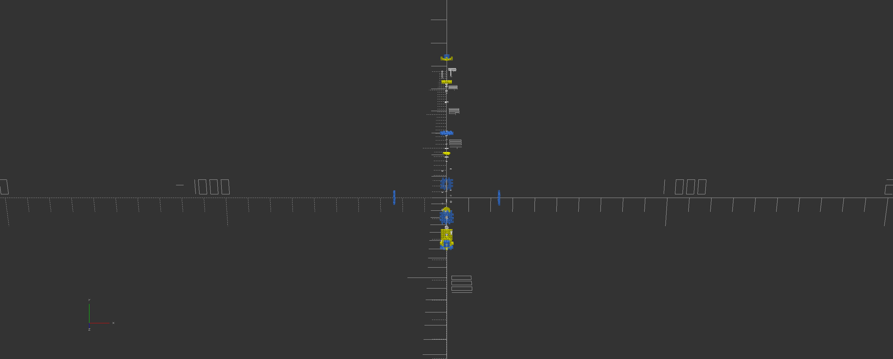

## About

* This is a very special project but it will remain in beta for some time. Consider it useable but there is much behind-the-scenes work being activly developed offline.
* As of September 2023 new requirenments have been identified which will carry this project to its higher stages.
* mupy's name and identity will eventually change entirely becasue it is becoming more clear everyday that this project would exist more appropriatly as an os image.


Python Manufacturing Utility or "mupy" is a powerful new digital-twin technology implemented as a Python pip installable package. In it's essence mupy is a platform for a new way to think about design, physical hardware, advanced assemblies, innovative technologies, or most generally speaking, system design. This package and the tools included empower users with hardware-class-objects in the Python scripting environment. mupy possesses features such as hardware and system generation, assembly and operational simulation, as well as metadata and resource renderings. mupy empowers the user with resources and speed. Get dangerous.

mupuy fearures include:

- Billions (of billions (of billions...)) of identifiable and discernible hardware elements and even more assemblies for 3D print, CNC, or any other form of manufacturing
- Programmatic representation of hardware & assemblies (composing of smaller hardware elements and sub-assemblies) within virtual 3D workspaces
- Operational and assembly simulations (animations) with real-time programmatic modification capabilities
- Integratable with thousands of other Python compatible technologies
- Ability to transfer complete knowledge of your innovations to others





# Overview

It is difficult to describe the full scope of features (both current and intended) but this overview paints a simple picture of the general process a user may adopt: 

## Program some code

1. Import the mupy library.

```python

import mupy.core as mu

```

2. Set up workspace directory.

```python
workspace_name = "custom_box"
workspace = mu.WorkSpace(str(Path.home())+"/"+workspace_name) # Creates workspace directory relative to home path.

```

3. Define hardware by name and system-code. Alternatively, you may place a .stl file path in the place of the system code.


```python
panel_a = mu.Hardware("panel_a", "CUBX0177-BPAN-B25SR2P5-X8Y8P18-RT-SX25Y25-X8Y8-X20Y20Z5")
panel_b = mu.Hardware("panel_b", "CUBX0177-BPAN-B25SR2P5-X8Y8P18-RT-SX25Y25-X8Y8-X20Y20Z5")
panel_c = mu.Hardware("panel_c", "CUBX0177-BPAN-B25SR2P5-X8Y8P18-RT-SX25Y25-X8Y8-X20Y20Z5")
panel_d = mu.Hardware("panel_d", "CUBX0177-BPAN-B25SR2P5-X8Y8P18-RT-SX25Y25-X8Y8-X20Y20Z5")
panel_e = mu.Hardware("panel_e", "CUBX0177-BPAN-B25SR2P5-X8Y8P18-RT-SX25Y25-X8Y8-X20Y20Z5")
panel_f = mu.Hardware("panel_f", "CUBX0177-BPAN-B25SR2P5-X8Y8P18-RT-SX25Y25-X8Y8-X20Y20Z5")

panel_a.color = "green"
panel_b.color = "blue"
panel_c.color = "orange"
panel_d.color = "red"
panel_e.color = "pink"
panel_f.color = "cyan"
```

4. Define initial and final coordinates within an assembly epoch.

```python
""" Defines coordinates for hardware components within workspace. """
alpha = 200 
assembly_coords_a = mu.Coordinates( z0 = 8 * 25 / 2 + alpha,             zf = 8 * 25 / 2                                       )
assembly_coords_b = mu.Coordinates( y0 = 8 * 25 / 2 + alpha,             yf = 8 * 25 / 2,             af = -90                 )
assembly_coords_c = mu.Coordinates( x0 = - 8 * 25 / 2 - alpha,           xf = - 8 * 25 / 2,           bf = -90                 )
assembly_coords_d = mu.Coordinates( z0 = -8 * 25 / 2 - alpha,            zf = -8 * 25 / 2,            bf = 180                 )
assembly_coords_e = mu.Coordinates( y0 = - 8 * 25 / 2 - alpha,           yf = - 8 * 25 / 2,           af = 90                  )
assembly_coords_f = mu.Coordinates( x0 = 8 * 25 / 2 + alpha,             xf = 8 * 25 / 2,             af = 90,       cf = 90   )
```

5. Defines assembly.

```python
""" Defines total assembly dynamics ; hardware componenets, names, coordinates, information and metadata. """
box_assembly = mu.Assembly("box_assembly")
box_assembly.include(panel_a, assembly_coords_a) 
box_assembly.include(panel_b, assembly_coords_b) 
box_assembly.include(panel_c, assembly_coords_c)
box_assembly.include(panel_d, assembly_coords_d)
box_assembly.include(panel_e, assembly_coords_e)
box_assembly.include(panel_f, assembly_coords_f)
```

6. Run assembly.

```python
workspace.run(box_assembly) # This command creates all directorires and assemblies.

```

## Generating Output
Once this script is executed, the workspace.run() mupy.core will generate a *workspace* directory and this will indicate the directory path containing your IP.

### Generated Workspace Directory
        .
        ├── box_assembly_A1cfc7f.scad
        ├── CUBX0177-BPAN-B15SR3-X12Y20PP2-RF-SX5Y10-X1Y1-XO0YO0-X30Y30Z20-S.scad
        ├── CUBX0177-BPAN-B15SR3-X20Y12PP2-RF-SX5Y5-X1Y1-XO0YO0-X30Y30Z20-S.scad
        ├── CUBX0177-BPAN-B15SR3-X8Y12PP2-RF-SX5Y3-X1Y1-XO0YO0-X30Y30Z20-S.scad
        ├── CUBX0177-BPAN-B15SR3-X8Y12PP2-RF-SX5Y5-X1Y1-XO0YO0-X30Y30Z20-S.scad
        ├── CUBX0177-BPAN-B15SR3-X8Y20PP2-RF-SX5Y10-X1Y1-XO0YO0-X30Y30Z20-S.scad
        ├── CUBX0177-BPAN-B15SR3-X8Y20PP2-RF-SX5Y3-X1Y1-XO0YO0-X30Y30Z20-S.scad
        ├── panel_a_P942313.scad
        ├── panel_b_Pef37ea.scad
        ├── panel_c_P52f602.scad
        ├── panel_d_P49e0f5.scad
        ├── panel_e_P3910d0.scad
        ├── panel_f_Pfe0d99.scad
        ├── scad
        │   └── CUBX0177.scad
        └── stl_files
            ├── CUBX0177-BPAN-B15SR3-X12Y20PP2-RF-SX5Y10-X1Y1-XO0YO0-X30Y30Z20-S.stl
            ├── CUBX0177-BPAN-B15SR3-X20Y12PP2-RF-SX5Y5-X1Y1-XO0YO0-X30Y30Z20-S.stl
            ├── CUBX0177-BPAN-B15SR3-X8Y12PP2-RF-SX5Y3-X1Y1-XO0YO0-X30Y30Z20-S.stl
            ├── CUBX0177-BPAN-B15SR3-X8Y12PP2-RF-SX5Y5-X1Y1-XO0YO0-X30Y30Z20-S.stl
            ├── CUBX0177-BPAN-B15SR3-X8Y20PP2-RF-SX5Y10-X1Y1-XO0YO0-X30Y30Z20-S.stl
            └── CUBX0177-BPAN-B15SR3-X8Y20PP2-RF-SX5Y3-X1Y1-XO0YO0-X30Y30Z20-S.stl


## Linux Installation

### Prerequisites

1. Install OpenSCAD (OpenSCAD programming language)

```console
$ apt install openscad
```

2. Install python3-pip ( python package manager )
```console
$ apt install python3-pip
```

3. Install git (if you plan to contribute or install by cloning) - Follow instructions at https://www.atlassian.com/git/tutorials/install-git
```console
$ sudo apt-get update 
```
```console
$ sudo apt-get install git
```

### Install mupy

1. Install mupy from the Python3 package-manager.
```console
$ pip3 install mupy
```
