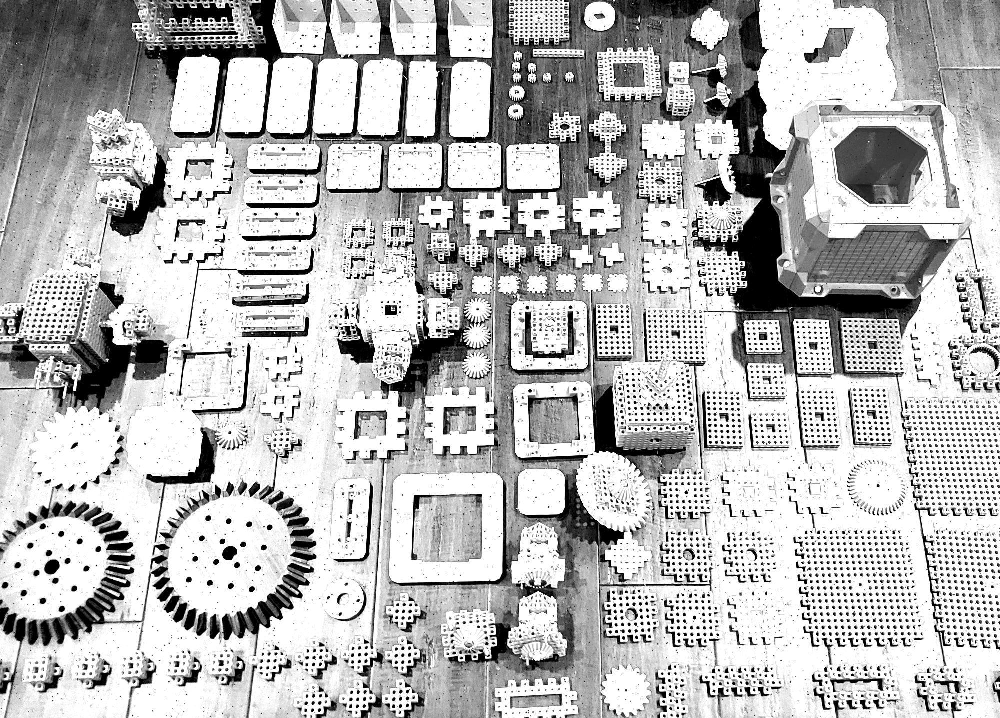
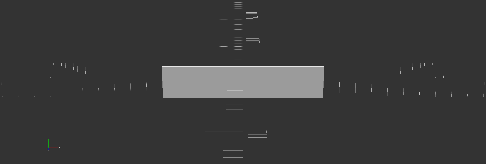
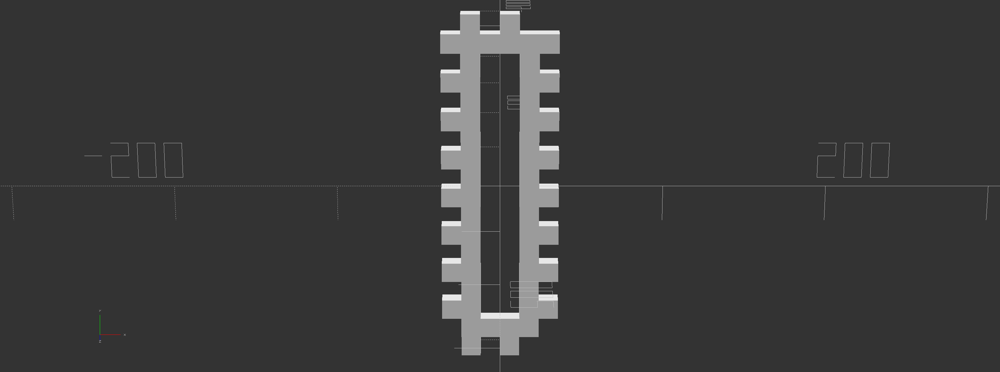

<!--
<p align="center">
  
</p>
-->
### DIsclaimer 
This project is not finished. The code is relatively stable and is on a soft release schedual. I am heavily testing mupy now but is quietly public. Others can use mupy if they want but they may have some difficulty in knowing which system codes to use since the documentation is still sparse. The README is still being written along with system-code documentation but the main code is there. Please forgive spelling or grammatical errors as finishing touches are being applied over the next couple months. Ill make a beta announcement later but I require public status for testing purposes at this time. Thankyou.

## Table of contents

<!--ts-->
   * [About](#about)
   * [Overview](#overview)
   * [Installation](#installation)
   * [Getting Started](#getting-started)
   * [Generating Output](#generating-output)
   * [Manufacturing](#manufacturing)
   * [Concepts](#concepts)
   * [Community](#contact)
   * [Contact](#other-information)
<!--te-->


# About

Python manufacturing utility or mupy is a powerful new digital-twin technology implemented as a python pip installable package. In it's essence mupy is a platform or a new way to think about design, physical hardware, advanced assemblies, innovative technologies or most generally speaking, systems. This package and the tools included empowers users with hardware-class-objects into the python scripting environment. mupy possesses features such as hardware & system generation, assembly & operational simulation, metadata & resources renderings. mupy empowers the user with resources and speed. Get dangerous.

- billions (of billions (of billions...)) of identifiable and discernible hardware elements and even more assemblies for 3D print, CNC or any other form of manufacturing
- programmatic representation ; of hardware & assemblies ( composing of smaller hardware elements and sub-assemblies ) within virtual 3D workspaces
- operational & assembly simulations (animations) with real-time programmatic modification capabilities
- Integratable with thousands of other python compatible technologies
- Transfer complete knowledge of your innovations to others

<p align="center">
  
</p>

## Note from the developer

mupy is more powerful than you would believe. It has grown too large to maintain alone and I have arrived at a good stopping point. mupy works well, too well perhaps but the most important thing is that it meets all preset requirements. The project now requires actual users to give feedback on the work done thus far. Currently, I can only afford commentary provided by actual users or practitioners who have demonstrated actual projects supported by mupy. If you are not sure if mupy is for your project, then read this README and try it for yourself first. In the meantime, I'll continue populating & cleaning mupy standard library (/mupy/lib) with additional hardware & assembly system-code sets ( which is abstracted away from the mupy.core library ). The standard-library is small but useful enough and with more time, additional hardware and assemblies can be certified. I am still learning this technology to be honest. It is very useful, I just hope other people can utilize, study and develop system-code tech becasue it is too powerful to be wasted. Also human agents are the only way to multiply system-code sets. 

### Caveats
The mupy-core package is not without issues and I would liek to be the first to make an analogy regarding the circumstance, try to imagine the mu technology as a recipe and mupy as the cuisine one prepares using substitution ingredients. Not ideal but aye, it works! Here are some glaring issues you should be aware of. These are community-grade caveats. 

- mupy is a package however an environment will be needed to utilize it; openscad will need to be installed (VSCode is also recommended)
- Stable on Linux Only ; Linux file systems are leveraged heavily. It doesn't yet work on Docker, Windows or MacOS. All are non-trivial fixes. Time and consideration are required to solve but can be solved hopefully sooner than later. All depends on supply and demand. The plan is to get everything working eventually but it has been lowered in terms of prioritization. Consider it beta.
- OpenScad is a fantastic technology to which mupy relies heavily on but it's 3D graphical user interface environments or features can not be called from python as objects yet. These environments are essential to make mupy "fun" but these modules are too tightly coupled to the integrated development environment which supports the openscad language. This is a fancy way of saying I am too dumb to figure it out myself within my time constraints. For this reason I designed mupy to essentially write openscad code directory structures and then the user operates or modifies the code from the openscad integrated development environment once mupy generates the code. One still should consider just modifying the original python code because it will work mid-animation anyways. As cumbersome as this all is, it is the standard protocol and very much worth it. mupy is a complex library. It is almost it's own language. No, scratch that. It's an ecosystem of languages. Writing with it may not be so easy. It's perfect for me, but that me.
- Standard library is still very small compared to future expectations.
- The worst caveat by far is the mapping system-code space. 


## Main Points
A collection or list of quick concepts, items and keywords which give an overview of whats mupy is all about.

### What is it?

Originally mu could of been thought of as an attempt to devise a physical analogy to a software-programming language. It also began to serve as a hyper-efficient storage medium for designs. The mu project was in past considered a hardware-assembly language but this interpretation became not entirely appropriate upon further realizations concerning the nature of the work being done. Some additional context; the mu project started off as an internal utility ( a bag of scripts really ) to a small but growing research and development operation. These scripts began to tie to eachother over time and automation began to ensue. But what was the operation? The operation was tasked with developing utility and recreational grade hardware which featured advanced modular properties and this began in 2017. I began to realize there was no perfect modular family but all families could be tied together with adaptive parts and software this was good enough. Also the system wasnt limited to modular hardware either. It could be used for anything as long as system-code constraints were not violated. This operation utilized a linux-openscad-python environment. Additionally there existed a 3D-printing and assembly sub-operation which provided even greater insight into the proper direction of mupy. mupy is many things, you may think of it as :

- Creation Engine

- Knowledge Transfer Mechanism

- Clone-able Supply Chain Asset

- Compression Algorithm

- Decentralized Innovation Utility

- Hardware Generator

- Applications-Programming Interface ( CLI Included )

- Openscad Horizontal Abstraction Layer & Formalism

- Technology Database

- Personal Economic Experiment

### How do I use mupy?

There are two interfaces for mupy, a command line interface (CLI) ( mostly a novelty but surprisingly very useful ) and an applications programming interface (API) They are described below.

- mucli - This is the manufacturing utility command line tool and is used to express the most rudimentary function of mupy ; to decode system-codes

- mu.core - A manufacturing oriented digital-twin technology implemented as a python3 library


# Overview

It is difficult to describe the full scope of features (both current and intended) but this overview paints a simple picture of the general process a user may adopt. 

## Program some code

1. Import the mupy library

```python

import mupy.core as mu

```

2. Set up workspace directory

```python
workspace_name = "custom_box"
workspace = mu.WorkSpace(str(Path.home())+"/"+workspace_name) # Creates workspace directory relative to home path.

```

3. Defines hardware by name and system-code. Alternativly you may place a .stl file path in the place of the system code.


```python
panel_a = mu.Hardware("panel_a", "CUBX0177-BPAN-B25SR2P5-X8Y8P18-RT-SX25Y25-X8Y8-X20Y20Z5")
panel_b = mu.Hardware("panel_b", "CUBX0177-BPAN-B25SR2P5-X8Y8P18-RT-SX25Y25-X8Y8-X20Y20Z5")
panel_c = mu.Hardware("panel_c", "CUBX0177-BPAN-B25SR2P5-X8Y8P18-RT-SX25Y25-X8Y8-X20Y20Z5")
panel_d = mu.Hardware("panel_d", "CUBX0177-BPAN-B25SR2P5-X8Y8P18-RT-SX25Y25-X8Y8-X20Y20Z5")
panel_e = mu.Hardware("panel_e", "CUBX0177-BPAN-B25SR2P5-X8Y8P18-RT-SX25Y25-X8Y8-X20Y20Z5")
panel_f = mu.Hardware("panel_f", "CUBX0177-BPAN-B25SR2P5-X8Y8P18-RT-SX25Y25-X8Y8-X20Y20Z5")

panel_a.color = "green"
panel_b.color = "blue"
panel_c.color = "orange"
panel_d.color = "red"
panel_e.color = "pink"
panel_f.color = "cyan"
```

4. Define initial and final coordinates within an assembly epoch.

```python
""" Defines coordinates for hardware components within workspace. """
alpha = 200 
assembly_coords_a = mu.Coordinates( z0 = 8 * 25 / 2 + alpha,             zf = 8 * 25 / 2                                       )
assembly_coords_b = mu.Coordinates( y0 = 8 * 25 / 2 + alpha,             yf = 8 * 25 / 2,             af = -90                 )
assembly_coords_c = mu.Coordinates( x0 = - 8 * 25 / 2 - alpha,           xf = - 8 * 25 / 2,           bf = -90                 )
assembly_coords_d = mu.Coordinates( z0 = -8 * 25 / 2 - alpha,            zf = -8 * 25 / 2,            bf = 180                 )
assembly_coords_e = mu.Coordinates( y0 = - 8 * 25 / 2 - alpha,           yf = - 8 * 25 / 2,           af = 90                  )
assembly_coords_f = mu.Coordinates( x0 = 8 * 25 / 2 + alpha,             xf = 8 * 25 / 2,             af = 90,       cf = 90   )
```

5. Defines assembly

```python
""" Defines total assembly dynamics ; hardware componenets, names, coordinates, information and metadata. """
box_assembly = mu.Assembly("box_assembly")
box_assembly.include(panel_a, assembly_coords_a) 
box_assembly.include(panel_b, assembly_coords_b) 
box_assembly.include(panel_c, assembly_coords_c)
box_assembly.include(panel_d, assembly_coords_d)
box_assembly.include(panel_e, assembly_coords_e)
box_assembly.include(panel_f, assembly_coords_f)
```

6. Run assembly

```python
workspace.run(box_assembly, mu.Coordinates()) # This command creates all directorires and assemblies.

```


## Generating Output
Once this script is executed, the workspace.run() mupy.core will generate a *workspace* directory and this will indicate the directory path containing your IP.

### Generated Workspace Directory
        .
        ├── box_assembly_A1cfc7f.scad
        ├── CUBX0177-BPAN-B15SR3-X12Y20PP2-RF-SX5Y10-X1Y1-XO0YO0-X30Y30Z20-S.scad
        ├── CUBX0177-BPAN-B15SR3-X20Y12PP2-RF-SX5Y5-X1Y1-XO0YO0-X30Y30Z20-S.scad
        ├── CUBX0177-BPAN-B15SR3-X8Y12PP2-RF-SX5Y3-X1Y1-XO0YO0-X30Y30Z20-S.scad
        ├── CUBX0177-BPAN-B15SR3-X8Y12PP2-RF-SX5Y5-X1Y1-XO0YO0-X30Y30Z20-S.scad
        ├── CUBX0177-BPAN-B15SR3-X8Y20PP2-RF-SX5Y10-X1Y1-XO0YO0-X30Y30Z20-S.scad
        ├── CUBX0177-BPAN-B15SR3-X8Y20PP2-RF-SX5Y3-X1Y1-XO0YO0-X30Y30Z20-S.scad
        ├── panel_a_P942313.scad
        ├── panel_b_Pef37ea.scad
        ├── panel_c_P52f602.scad
        ├── panel_d_P49e0f5.scad
        ├── panel_e_P3910d0.scad
        ├── panel_f_Pfe0d99.scad
        ├── scad
        │   └── CUBX0177.scad
        └── stl_files
            ├── CUBX0177-BPAN-B15SR3-X12Y20PP2-RF-SX5Y10-X1Y1-XO0YO0-X30Y30Z20-S.stl
            ├── CUBX0177-BPAN-B15SR3-X20Y12PP2-RF-SX5Y5-X1Y1-XO0YO0-X30Y30Z20-S.stl
            ├── CUBX0177-BPAN-B15SR3-X8Y12PP2-RF-SX5Y3-X1Y1-XO0YO0-X30Y30Z20-S.stl
            ├── CUBX0177-BPAN-B15SR3-X8Y12PP2-RF-SX5Y5-X1Y1-XO0YO0-X30Y30Z20-S.stl
            ├── CUBX0177-BPAN-B15SR3-X8Y20PP2-RF-SX5Y10-X1Y1-XO0YO0-X30Y30Z20-S.stl
            └── CUBX0177-BPAN-B15SR3-X8Y20PP2-RF-SX5Y3-X1Y1-XO0YO0-X30Y30Z20-S.stl


## Running openscad

1. Navigate to workspace directory

```console
$ cd ~/custom_box
```

2. Open 'box_assembly' file

```console
$ openscad box_assembly_A1cfc7f.scad
```
### Modifying generated code
Feel free to modify any scad-code for whatever reason you see fit (typically position, angle or other parametrization) since it is easy enough to regenerate but it is often not necessary because you can do the same from mupy. Keep in mind that these hashes are predicable because they are derived from system codes and names which if do not change, will not affect the change the hash.

### Activating Animation Controller
From the openscad IDE toolbar select View -> Animate.  Under the main view some animation text field inputs will appear. Select a frame rate and step count to run animation. These numbers will influence the evolution of the value of the special global time variable denoted by $t ( 0 ≤ $t ≤ 1 ) recognized by openscad and generated by mupy. This will in turn drive the animations. 


### Simulate assembly
As was stated before, once the script is run, mupy will generate a workspace directory with generated scad source code files. These files build a hierarchical structure for defining the overall assembly. This breaks things into steps with no specific order in the current implementation. These files are marked with an *'A'* or a *'P'* at the beginning of their hash in the file name to signify an *assembly* or *hardware* object respectively. Some of the code (system-code scad files) are used to render *.stl files* which are then imported directly into the assembly hierarchy ( and are used to make prints ). Just click on the assembly .scad file which can be identified by the name that was given in the script unpo declaration. Additionally the hashes are predictable so that the simulation may be re-run (with modification) without canceling the openscad IDE or animation.


This example gives users the resources to construct a simple box. This example utilizes the CUBX0177 family and the mupy.core library. For this script, modular principles are employed however generally speaking system-codes only interlock with other certain system-codes. In the case of the CUBX0177 family the first five elements composing the system code strings should be synchronized for modularity to be possible. Keep in mind that every type-code has its own rules that it must follow and in some cases specific parametrization choices will override other intended features. In other cases the systems-codes won't even be meaningful geometrically unless the libraries have built in their own boundary-conditions to keep certain codes non-render-able.

### Generating Gifs
I use a utility called ImageMagick and you can learn more about it from Bryan Duxbury's Blog at https://bryanduxbury.com/2014/01/16/creating-animated-gifs-from-openscad/. These gifs are created using the 

## 3D Printing
 
3D printers are getting better by the day but the community has been unable to utilize their true capabilities.  This is mostly becasue the design sets available from the open domain are very limited. This is to say there are not alot of proffesionals developing hardware designs for 3D printers to print, and especially not things utility grade. Additionally, manufacturing proffesionals and leaders tend to watse time comparing addative manufacturing methods to traditional manufacturing methods such as injection molding or casting. 3D printers are slow wheras traditional methods are fast. I am very familiar with the narrative but one never seems to consider the possibilities of 3D printers. The rapid modificiation/ modular culture which could never be caught up with. Once materials get better. 


My point is that   has matched the capabliliteis of 3D printers untilnow. mupy was not designed for just 3D printing alone but it was certainly battle-tested with 3D printing. To go down this path, you will need to download *Ultimaker Cura* (or some other slicing software) in order to move forward with this step. You can download it from https://ultimaker.com/software/ultimaker-cura .


### Print Parts ( or manufacture another way )

To print parts just import the generated stl file into [Ultimaker Cura](https://ultimaker.com/software/ultimaker-cura) and proceed with setting up your 3D-print configuration. In general all 3D-printed parts require configuration so be sure to familiarize yourself with the process. [This video runs through the process quite well](https://www.youtube.com/watch?v=T-Z3GmM20JM)

### Running Cura - Rough Overview

  1. Open Ultimaker Cura

  2. Once downloaded you should take time to familiarize yourself with basic 3D printing concepts. Some common examples include 

    - Print Bed Temperature
    - Nozzle Temperature
    - Retraction State
    - Cleaning
    - Filament
    - Supports 
    - Print Speed

Some of these things and more are configurable in in Cura, which can be thought of as a pre-print application which feeds instructions to the 3D printers with the gcode file it generates. For starters try importing an stl file generated from custom_box.py

  2. In the header select File -> Open File(s) to load an object.
  3. Configure position and angle of object by selecting it.
  4. Add any more additional objects that you may want to fit on print bed be repeating steps 1 and 2 ( Make sure the 3D printer model or print-bed size is known and configured by the Cura system. ).
  5. Configure print settings.
  6. Generate gcode file and store on SD drive ( or whatever the 3D printer requires )
  7. 3D Print!


### Clean Parts
Depending on the part, you may need to clean it for it to be functional. This is not always the case and many of the parts mupy provides do not render any wasted filament to begin with but this is not the general case when 3D-printing.

### Assemble parts

So this is the fun part. You assemble the printed parts and make sure they fit all together. Good Luck!

## Optimize Assembly/Script

One way to think about why one may consider using mupy scripting tools is to imagine the scenario of having in your possession some prototype you wish to take to the next stage and along-side it a corresponding script reflecting it's digital twin available to you. The basic idea is that this mupy script would match the state of the physical prototype and allow the user to make programmatic modifications to the simulation environment and render resources in an instant without halting the simulation or breaking a sweat. This would support the evolution of the physical prototype as well. This is how I use it and it's fast. This will in turn support the continued evolution of the project without risking costly materials. Once optimized, the script becomes meaningful, powerful and valuable. This person may then possess the right to sell this intellectual property at some price they see fit. They could also manufacture it whenever they wanted to. This efficiency could then further multiplied if the knowledge regarding it's assembly and operation are transferred digitally, decoded and manufactured remotely. It is believed that this kind of environment will support commerce and reduce cost for many people generally speaking once newer layers of tweaking and customizations are made available in the form of new system codes.

### Transfer knowledge in a capacity that sustains growth and commerce.

Yeah, use these parts and start a business or do whatever you want.

### Certify Assembly/Script (Optional)
The whole point of mupy is to script hardware and assemblies using system codes but what if the entire script could be cast as one. Let that sink in.


# Installation

If you are a 3D printer enthusiast, wood worker, developer, artist, inventor, entrepreneur looking for an internal utility to manage your projects then mupy is for you.


## Linux Installation

### Prerequisites

1. Install openscad ( openscad programming language )

```console
$ apt install openscad
```

2. Install python3-pip ( python package manager )
```console
$ apt install python3-pip
```

3. Install git (if you plan to contribute or install by cloning) - Follow instructions at https://www.atlassian.com/git/tutorials/install-git
```console
$ sudo apt-get update 
```
```console
$ sudo apt-get install git
```

### Install mupy

1. Install mupy from the python3 package-manager.
```console
$ pip3 install mupy
```
<!--
## MacOS Installation

* There are non-trivial issues associated with this installation. MacOS makes it very difficult to install openscad on certain versions such as Monterey, because of verification protocols implemented by apple. This is unfortunate because at this time mupy essentially writes scad code but requires an instance of the installation to function. My apologies.
### Prerequisites
Open the MacOS terminal and run the following commands:

1. Install homebrew  
```console
% ruby -e "$(curl -fsSL https://raw.githubusercontent.com/Homebrew/install/master/install)" brew doctor
```
    
2. Set python as an environmental variable. 
```console
% export PATH="/usr/local/opt/python/libexec/bin:$PATH"
```

3. Install git (if you plan to contribute or install by cloning)
```console
% brew install git
```

4. Install python3 and pip3 (https://docs.python-guide.org/starting/install3/osx/)
```console
% brew install python3
```
5. Post-install routine.   
```console
% brew postinstall python3
```

6. Install openscad - Follow instructions at https://openscad.org/downloads.html or https://ports.macports.org/port/openscad/

### Install mupy

1. Install mupy from the python3 package-manager.
```console
% pip3 install mupy
```
## Windows Installation

### Prerequisites

1. Install Python3 & pip3

  Navigate to https://www.python.org/downloads/ and follow install instructions.
    
2. Install git (if you plan to contribute or install by cloning)

  Navigate to https://gitforwindows.org/ and follow install instructions.

3. Install openscad

  Navigate to https://openscad.org/downloads and follow install instructions.

### Install mupy

1. Install mupy from the python3 package-manager.

```console
> pip3 install mupy
```

## Docker Installation

If you prefer to use the provided docker image you will need to install docker at https://docs.docker.com/get-docker/ .

1. Build image
```console
$ docker build -t mu .
```

2. Run container
```console
$ docker run -i mu:latest
```

3. SSH into container
```console
$ docker exec -it mu:latest /bin/bash
```
-->
    
# Getting Started

## Manufacturing Utility Command-Line-Tool (mucli)

μpy comes with it bundled a command-line-interface application known as mucli or mucli-tool and behaves much like a Linux terminal except that it only accepts special strings known as 'system-codes'. mucli was developed to express to users mupy's most rudimentary operation ; rendering precision manufacturing resources for a given system-code. To enter mucli, in the Linux terminal, navigate to the mucli directory in the project folder

```console
$ python3 <package_location>/mupy/mucli/mucli.py 
```

- system codes are fundamental to the mupy model and are explained further below. They are essentially used to rapidly development parts and systems from already authored libraries. The system codes contain parametrization data and can be read/write by the human.

### Imputing a system-code

Each system-code corresponds to a specific part. Once typed press enter to generate resources. Here are a few examples below of some system-codes and their corresponding hardware elements.

    μ:# CUBX0006-BLK-L1000W200H15



    μ:# CRSPGR022-SG-M1-T34W8-P15H15-B4-T


    μ:# CUBX0177-BPAN-B12SR0-X6Y18PP12-XF-SX10Y10-X1Y1-XO0YO0-X24Y168Z25-S




## Scripting with mupy.core

### custom_box.py

The script below 'custom_box.py' is a modification of the previous 'simple_box.py'. Below is an example of parametrization being applied on a higher level using python; now the variables which plug into system codes can be configured at the script level and it makes things easier when you want a customize certain aspects of the assembly you're designing in a quick fashion. The hope is that we can as a community identify and build new family codes and schemas.

```python
#!/usr/bin/env python3

""" Required libray imports. """
from pathlib import Path # Imports library nessecary for fetching terminal path information.
import mupy.core as mu # Imports mupy library.

""" Set up workspace. """
workspace_name = "custom_box" # Workspace name ; this will be the name of the workspace directory.
workspace = mu.WorkSpace(str(Path.home())+"/"+workspace_name) # Creates workspace.

""" Set up workspace. """
unit_block_length = 15 # The CUBX0177 family contains a unit_block_length parameter.
shaft_radius = 3 # The CUBX0177 family contains a shaft_radius parameter which makes reference to a shaft radius within each unit block in the x,y and zed dimensions.

""" Defines the dimensions of the total custom box.in units of unit_bock_length. """
box_x_units = 8 # Defines the count of 'block units' in the x dimension that make up custom box.
box_y_units = 20 # Defines the count of 'block units' in the y dimension that make up custom box.
box_z_units = 12 # Defines the count of 'block units' in the z dimension that make up custom box.

""" Defines the dimensions of the individual panels making up the custom box which are themselves derived from the box dimensions defined in units of unit_bock_length. """
panel_a_x_block_units = box_x_units # Equation must be satisfied in order to express custom-box function. 
panel_a_y_block_units = box_y_units # Equation must be satisfied in order to express custom-box function. 
panel_b_x_block_units = box_x_units # Equation must be satisfied in order to express custom-box function. 
panel_b_y_block_units = box_z_units # Equation must be satisfied in order to express custom-box function. 
panel_c_x_block_units = box_z_units # Equation must be satisfied in order to express custom-box function. 
panel_c_y_block_units = box_y_units # Equation must be satisfied in order to express custom-box function. 
panel_d_x_block_units = box_x_units # Equation must be satisfied in order to express custom-box function. 
panel_d_y_block_units = box_y_units # Equation must be satisfied in order to express custom-box function. 
panel_e_x_block_units = box_x_units # Equation must be satisfied in order to express custom-box function. 
panel_e_y_block_units = box_z_units # Equation must be satisfied in order to express custom-box function. 
panel_f_x_block_units = box_y_units # Equation must be satisfied in order to express custom-box function. 
panel_f_y_block_units = box_z_units # Equation must be satisfied in order to express custom-box function. 

""" Define hardware using system codes. System Codes here are being subject to programmatic parametrization. """
panel_a = mu.Hardware("panel_a", "CUBX0177-BPAN-B"+str(unit_block_length)+"SR"+str(shaft_radius)+"-X"+str(panel_a_x_block_units)+"Y"+str(panel_a_y_block_units)+"PP2-RF-SX5Y3-X1Y1-XO0YO0-X30Y30Z20-S")     # Constructs panel : This hardware component is a box panel of a CUBX0177-class hardware component.
panel_b = mu.Hardware("panel_b", "CUBX0177-BPAN-B"+str(unit_block_length)+"SR"+str(shaft_radius)+"-X"+str(panel_b_x_block_units)+"Y"+str(panel_b_y_block_units)+"PP2-RF-SX5Y3-X1Y1-XO0YO0-X30Y30Z20-S")     # Constructs panel : This hardware component is a box panel of a CUBX0177-class hardware component.
panel_c = mu.Hardware("panel_c", "CUBX0177-BPAN-B"+str(unit_block_length)+"SR"+str(shaft_radius)+"-X"+str(panel_c_x_block_units)+"Y"+str(panel_c_y_block_units)+"PP2-RF-SX5Y10-X1Y1-XO0YO0-X30Y30Z20-S")    # Constructs panel : This hardware component is a box panel of a CUBX0177-class hardware component.
panel_d = mu.Hardware("panel_d", "CUBX0177-BPAN-B"+str(unit_block_length)+"SR"+str(shaft_radius)+"-X"+str(panel_d_x_block_units)+"Y"+str(panel_d_y_block_units)+"PP2-RF-SX5Y10-X1Y1-XO0YO0-X30Y30Z20-S")    # Constructs panel : This hardware component is a box panel of a CUBX0177-class hardware component.
panel_e = mu.Hardware("panel_e", "CUBX0177-BPAN-B"+str(unit_block_length)+"SR"+str(shaft_radius)+"-X"+str(panel_e_x_block_units)+"Y"+str(panel_e_y_block_units)+"PP2-RF-SX5Y5-X1Y1-XO0YO0-X30Y30Z20-S")     # Constructs panel : This hardware component is a box panel of a CUBX0177-class hardware component.
panel_f = mu.Hardware("panel_f", "CUBX0177-BPAN-B"+str(unit_block_length)+"SR"+str(shaft_radius)+"-X"+str(panel_f_x_block_units)+"Y"+str(panel_f_y_block_units)+"PP2-RF-SX5Y5-X1Y1-XO0YO0-X30Y30Z20-S")     # Constructs panel : This hardware component is a box panel of a CUBX0177-class hardware component.

""" Defines coordinates for hardware components within workspace. """
alpha = 230 # Equation must be satisfied in order to express custom-box function. Alpha is a constant which is useful for describing the distance between panels in the custom box.
assembly_coords_a = mu.Coordinates( z0 = box_z_units * unit_block_length / 2 + alpha,             zf = box_z_units * unit_block_length / 2                                       )     # Equation must be satisfied in order to express custom-box function. 
assembly_coords_b = mu.Coordinates( y0 = box_y_units * unit_block_length / 2 + alpha,             yf = box_y_units * unit_block_length / 2,             af = -90                 )     # Equation must be satisfied in order to express custom-box function. 
assembly_coords_c = mu.Coordinates( x0 = - box_x_units * unit_block_length / 2 - alpha,           xf = - box_x_units * unit_block_length / 2,           bf = -90                 )     # Equation must be satisfied in order to express custom-box function. 
assembly_coords_d = mu.Coordinates( z0 = - box_z_units*unit_block_length / 2 - alpha,             zf = - box_z_units*unit_block_length / 2,             bf = 180                 )     # Equation must be satisfied in order to express custom-box function. 
assembly_coords_e = mu.Coordinates( y0 = - box_y_units * unit_block_length / 2 - alpha,           yf = - box_y_units * unit_block_length / 2,           af = 90                  )     # Equation must be satisfied in order to express custom-box function. 
assembly_coords_f = mu.Coordinates( x0 = box_x_units * unit_block_length / 2 + alpha,             xf = box_x_units * unit_block_length / 2,             af = 90,       cf = 90   )     # Equation must be satisfied in order to express custom-box function. 

""" Defines total assembly dynamics ; hardware components, names, coordinates, information and metadata. """
box_assembly = mu.Assembly("box_assembly")
box_assembly.include(panel_a, assembly_coords_a) # Includes part into workspace with coordinate set. Keep in mind coordinates are contextual within an assembly and are not features of the part.
box_assembly.include(panel_b, assembly_coords_b) # Includes part into workspace with coordinate set. Keep in mind coordinates are contextual within an assembly and are not features of the part.
box_assembly.include(panel_c, assembly_coords_c) # Includes part into workspace with coordinate set. Keep in mind coordinates are contextual within an assembly and are not features of the part.
box_assembly.include(panel_d, assembly_coords_d) # Includes part into workspace with coordinate set. Keep in mind coordinates are contextual within an assembly and are not features of the part.
box_assembly.include(panel_e, assembly_coords_e) # Includes part into workspace with coordinate set. Keep in mind coordinates are contextual within an assembly and are not features of the part.
box_assembly.include(panel_f, assembly_coords_f) # Includes part into workspace with coordinate set. Keep in mind coordinates are contextual within an assembly and are not features of the part.

""" Run workspace. """
workspace.run(box_assembly, mu.Coordinates()) # This command creates all directorires and assemblies.

```

### custom-box.py Simulation


### double_box.py
The double_box script was designed to illustrate basic encapsulation principles expressed by assembly objects. Essentially assembly objects are in many ways just like hardware objects because they can both be included in a workspace or assembly and they can both be assigned coordinates. The only difference is that assemblies do not  possess system codes (yet) instead they are just considered collections of sub-system-codes and their corresponding coordinate sets. The other difference is that primitive hardware components are built from openscad whereas assemblies within  their respective 'workspace' are built by python scripts. This is not a rule as much as it is a trend. 
```python

#!/usr/bin/env python3

"""
Note to user : This script as seen on GitHub is used to illustrate the power of mupy parametrization and how it can be manipulated with python calls.
"""

""" Required Libray Imports. """
from pathlib import Path # Imports library nessecary for fetching terminal path information.
import mupy.core as mu # Imports mupy library.

""" Set Up Workspace. """
workspace_name = "double_box" # Workspace name ; this will be the name of the workspace directory.
workspace = mu.WorkSpace(str(Path.home())+"/"+workspace_name) # Creates workspace.

""" Define Hardware Components"""
panel_a = mu.Hardware("panel_a", "CUBX0177-BPAN-B25SR2P5-X8Y8PP2-RT-SX10Y10-X1Y1-XO0YO0-X70Y70Z10-S")

panel_a.color = "blue"

panel_b = mu.Hardware("panel_b", "CUBX0177-BPAN-B25SR2P5-X8Y8PP2-RT-SX10Y10-X1Y1-XO0YO0-X70Y70Z10-S")
panel_c = mu.Hardware("panel_c", "CUBX0177-BPAN-B25SR2P5-X8Y8PP2-RT-SX10Y10-X1Y1-XO0YO0-X70Y70Z10-S")
panel_d = mu.Hardware("panel_d", "CUBX0177-BPAN-B25SR2P5-X8Y8PP2-RT-SX10Y10-X1Y1-XO0YO0-X70Y70Z10-S")
panel_e = mu.Hardware("panel_e", "CUBX0177-BPAN-B25SR2P5-X8Y8PP2-RT-SX10Y10-X1Y1-XO0YO0-X70Y70Z10-S")
panel_f = mu.Hardware("panel_f", "CUBX0177-BPAN-B25SR2P5-X8Y8PP2-RT-SX10Y10-X1Y1-XO0YO0-X70Y70Z10-S")

panel_a.color = "red"

panel_g = mu.Hardware("panel_g", "CUBX0177-BPAN-B25SR2P5-X8Y8PP2-RT-SX10Y10-X1Y1-XO0YO0-X70Y70Z10-S")
panel_h = mu.Hardware("panel_h", "CUBX0177-BPAN-B25SR2P5-X8Y8PP2-RT-SX10Y10-X1Y1-XO0YO0-X70Y70Z10-S")
panel_i = mu.Hardware("panel_i", "CUBX0177-BPAN-B25SR2P5-X8Y8PP2-RT-SX10Y10-X1Y1-XO0YO0-X70Y70Z10-S")
panel_j = mu.Hardware("panel_j", "CUBX0177-BPAN-B25SR2P5-X8Y8PP2-RT-SX10Y10-X1Y1-XO0YO0-X70Y70Z10-S")
panel_k = mu.Hardware("panel_k", "CUBX0177-BPAN-B25SR2P5-X8Y8PP2-RT-SX10Y10-X1Y1-XO0YO0-X70Y70Z10-S")
panel_l = mu.Hardware("panel_l", "CUBX0177-BPAN-B25SR2P5-X8Y8PP2-RT-SX10Y10-X1Y1-XO0YO0-X70Y70Z10-S")

""" Define Hardware Assembly Coordinates"""

alpha = 200 
panel_a_assembly_coords = mu.Coordinates(0.2,0.75,[0, 0 , 8 * 25 / 2 + alpha],[0, 0 , 8 * 25 / 2 ],[0,0,0],[0,0,0]) # Equation must be satisfied in order to express custom-box function. 
panel_b_assembly_coords = mu.Coordinates(0.2,0.75,[0, 8 * 25 / 2 + alpha, 0],[0, 8 * 25 / 2, 0],[0,0,0],[-90,0,0]) # Equation must be satisfied in order to express custom-box function. 
panel_c_assembly_coords = mu.Coordinates(0.2,0.75,[ - 8 * 25 / 2 - alpha, 0, 0 ],[ - 8 * 25 / 2, 0, 0 ],[0,0,0],[0,-90,0]) # Equation must be satisfied in order to express custom-box function. 
panel_d_assembly_coords = mu.Coordinates(0.2,0.75,[0 , 0, -8 * 25 / 2 - alpha],[0 , 0, -8 * 25 / 2 ],[0,0,0],[0,180,0]) # Equation must be satisfied in order to express custom-box function. 
panel_e_assembly_coords = mu.Coordinates(0.2,0.75,[0, - 8 * 25 / 2 - alpha, 0 ],[0, - 8 * 25 / 2, 0 ],[0,0,0],[90,0,0]) # Equation must be satisfied in order to express custom-box function. 
panel_f_assembly_coords = mu.Coordinates(0.2,0.75,[8 * 25 / 2 + alpha, 0 , 0],[8 * 25 / 2, 0 , 0],[0,0,0],[90,0,90]) # Equation must be satisfied in order to express custom-box function. 

panel_g_assembly_coords = mu.Coordinates(0.2,0.75,[0, 0 , 8 * 25 / 2 + alpha],[0, 0 , 8 * 25 / 2 ],[0,0,0],[0,0,0]) # Equation must be satisfied in order to express custom-box function. 
panel_h_assembly_coords = mu.Coordinates(0.2,0.75,[0, 8 * 25 / 2 + alpha, 0],[0, 8 * 25 / 2, 0],[0,0,0],[-90,0,0]) # Equation must be satisfied in order to express custom-box function. 
panel_i_assembly_coords = mu.Coordinates(0.2,0.75,[ - 8 * 25 / 2 - alpha, 0, 0 ],[ - 8 * 25 / 2, 0, 0 ],[0,0,0],[0,-90,0]) # Equation must be satisfied in order to express custom-box function. 
panel_j_assembly_coords = mu.Coordinates(0.2,0.75,[0 , 0, -8 * 25 / 2 - alpha],[0 , 0, -8 * 25 / 2 ],[0,0,0],[0,180,0]) # Equation must be satisfied in order to express custom-box function. 
panel_k_assembly_coords = mu.Coordinates(0.2,0.75,[0, - 8 * 25 / 2 - alpha, 0 ],[0, - 8 * 25 / 2, 0 ],[0,0,0],[90,0,0]) # Equation must be satisfied in order to express custom-box function. 
panel_l_assembly_coords = mu.Coordinates(0.2,0.75,[8 * 25 / 2 + alpha, 0 , 0],[8 * 25 / 2, 0 , 0],[0,0,0],[90,0,90]) # Equation must be satisfied in order to express custom-box function. 


""" Define assembly. """
box_assembly_1 = mu.Assembly("box_assembly_1")
box_assembly_1.include(panel_a, panel_a_assembly_coords) 
box_assembly_1.include(panel_b, panel_b_assembly_coords) 
box_assembly_1.include(panel_c, panel_c_assembly_coords)
box_assembly_1.include(panel_d, panel_d_assembly_coords)
box_assembly_1.include(panel_e, panel_e_assembly_coords)
box_assembly_1.include(panel_f, panel_f_assembly_coords)

box_assembly_2 = mu.Assembly("box_assembly_2")
box_assembly_2.include(panel_g, panel_g_assembly_coords)
box_assembly_2.include(panel_h, panel_h_assembly_coords)
box_assembly_2.include(panel_i, panel_i_assembly_coords)
box_assembly_2.include(panel_j, panel_j_assembly_coords)
box_assembly_2.include(panel_k, panel_k_assembly_coords)
box_assembly_2.include(panel_l, panel_l_assembly_coords)

beta = 1000
box_assembly_1_coords = mu.Coordinates(0.1,0.5,[8 * 25 / 2 + beta,0,0],[8 * 25 / 2,0,0],[0,0,0],[0,0,0]) # Equation must be satisfied in order to express custom-box function. 
box_assembly_2_coords = mu.Coordinates(0.5,0.8,[-8 * 25 / 2 - beta ,0,0],[-8 * 25 / 2,0,0],[0,0,0],[0,0,0]) # Equation must be satisfied in order to express custom-box function. 

system_assembly_1 = mu.Assembly("system_assembly_1")
system_assembly_1.include(box_assembly_1, box_assembly_1_coords) # Coordinates complete!
system_assembly_1.include(box_assembly_2, box_assembly_2_coords) # Coordinates complete!


""" Run """
workspace.run(system_assembly_1, mu.Coordinates(0,1,[0,0,0],[0,0,0],[0,0,0],[0,0,0])) # This command creates all directorires and assemblies.


```
### double-box.py Simulation


## Road-map

### Build a community
This kind of technology cannot grow without a community. The expectation is that this community would provide real visions, real milestones and real goals which are tangible and linkable to other projects being developed at the same time by the same community. This is to say I imagine a coordinated machine of innovation rapidly accelerating until the most beautiful system-codes are devised and we are all in space with pretty fusion engines. I know it sounds crazy but why the hell not. Lets build a space-ship or something. The point is that the community may identify worthwhile proposals for features. Consider that the scripting interface makes it much easier for people and organizations to coordinate larger projects and integrate other technologies using a version control systems like GitHub. Things a community may do :

- Cultivate Design Wish-list
- Gather Requirements
- Stand Up Massive Scale Decentralized Projects
- Stand Up Markets
- Devise canonacle formalisms to strengthen the technology
  
### Author More System-Code Libraries
More family codes means more parts to print or more possible things to assemble. This has an exponential effect. This will reinforce the integrity of mupy and the likelihood to attract users. Additionally we want to add constraints that keep certified families clean of defunct parts which should not or could not be printed. 

### Automated certification routines
This feature would be very powerful. Not yet complete. Certification is a non-trivial yet predictable operation. No one is even close to needing this feature yet. Few would be this advanced.

## Contributing

Currently the simplest form of contribution would be to star the repository or attempt to use the system for real development. Below are some more specific suggestions :

### Requirements Gathering
People should identify things to be built. Take note every time this happens, new family codes become realized or identified and need to be authored and certified but this is OK. This is how libraries are born : requirements. After all necessity is the mother of all invention. Chances are I can help with building some of the hardware libraries if your serious.

### Building New Libraries
Currently mupy only has a standard library which can be modified manually but in time we will implement features which allow new remote libraries to be accessed too.

### Improvements to mu command-line-tool
Currently the command line tool is extremely crude. The reasons for this are non-interesting but I typically build command line tools in my projects to illustrate basic functionality and prototyping. The mucli tool is no different except that I really like it's overall form in principle. The idea of just typing in a system-code to get quick resources is really cool and useful to me. I needs to be better and this is just a whole bag of things too complicated to mention. I am sure others have done this before.

## Licensing Structure
All subdirectories which contain a license will be represented by that license. This is always a subdirectory representing a family code or name-space. In this way mupy can be thought of as an abstraction that makes efficient calls to some library which may contain a different license. Additionally one could protect a library with authentication / permissions systems. 

### mupy.core license
The top level directory license applies to all contained files and directories EXCEPT for family code files and directories which should be thought of as python sub-packages which always contain their own source code file, license and digital-twin python class. This license overrides the top level license and applies to all same-directory-files and same-directory-directories.

### mupy.lib licenses
Individual hardware families are guided by their own license agreements. Each hardware family directory will posses a license file. The mupy package makes calls to these libraries which exist as sub-directories currently.

## FAQ

### Why should I install mupy
If you own a 3D printer or CNC equipment then you would have access to parts which you could manufacture for free. The standard library is populated with some useful hardware elements.
  - Print toys for your kids.
  - Repair custom equipment on the cheap
  - Design stuff and build your own libraries
  - Simulate assemblies
  - Integrate with other technologies such as artificial intelligence video-games
  - Develop mupy itself

### How many system-codes are available?
The available system-code permutation set is an incalculable number and is believed to be on the order of order of quintillions of quintillions of quintillions of parts built just by myself however the assembly technology and the ability to cast or map assembly-sets to system-code-sets easily diverges this number to infinity. It really depends on the users themselves. My personal two-cents ; don't focus on all the possible assemblies, rather focus on getting the sub-assemblies and parts required to assemble the best system-code-set.

### Is it free?
Yes! but only the core technology is free, the various family code libraries which should each contain their own license which states the conditions for use. In most cases it is free to use but read the license always.

### Does mupy replace CAD?
Absolutely not, mupy is it's own thing and solves different problems. In some cases it may reduce or replace the hours spent using CAD and in other cases it may increase the time people spend. If used in conjunction, you may get an optimized effect depending on your work. CAD simply doesn't provide system-code technology; this much is true. And system code technology is exponentially more overpowered. If there is an argument against CAD, that would be it. CAD however is optimized, mupy is rudimentary. Apples and oranges, but I like fruit salad. Additionally the simulation environment is far more intuitive and can be automated with scripts if one chooses. traditional CAD doesn't do that.

## Contacts:

| Company             | Project Team          | Role           | Email                          |
|-------------------- | --------------------- | -------------- | ------------------------------ |
| Ryan Solutions Inc. | Michael C Ryan        | Lead Developer | spacetime.engineer@gmail.com   |
  
<!-- ACKNOWLEDGMENTS -->
## Acknowledgments

* [Openscad Community](https://github.com/openscad/openscad)
* [Python community](https://www.python.org/)
* [PiPy community](https://www.python.org/)
* [Docker community](https://www.docker.com/)
