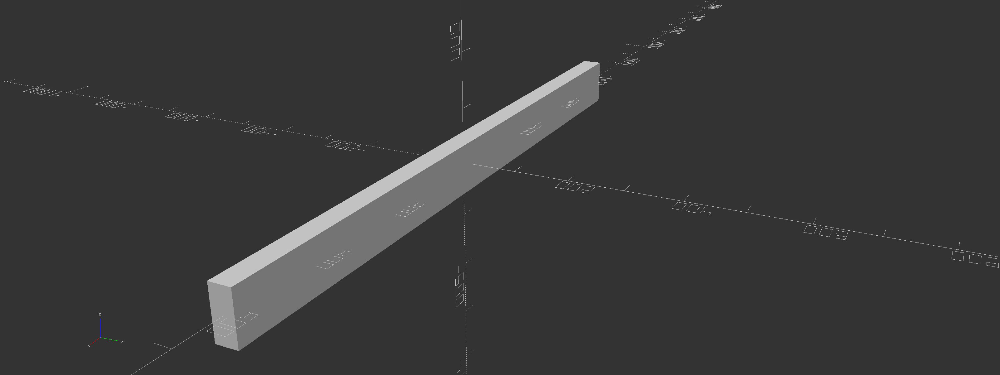

## Table of contents

<!--ts-->
   * [About](#about)
      * [Overview](#overview)
      * [Note From The Developer](#note-from-the-developer)
      * [Main Points](#main-points)
   * [Installation](#installation)
      * [Linux Installation](#linux-installation)
      * [MacOS Installation](#macos-installation)
      * [Windows Installation](#windows-installation)
      * [Docker Installation](#docker-installation)
   * [Getting Started](#getting-started)
   * [Generating Output](#dependency)
      * [Generated Workspace Directory](#generating-workspace-directory)
      * [Running openscad](#running-openscad)
   * [3D Printing](#3d-printing)
      * [Running Cura - Rough Overview](#running-cura-rough-overview)
   * [Concepts](#tests)
      * [system-codes](#system-codes)
      * [family-codes](#family-codes)
      * [type-codes](#type-codes)
      * [schemas](#schemas)
   * [History](#history)
     * [Project ρ](#project-ρ)
     * [Project ρ++](#project-ρ++)
     * [Project ψ](#project-ψ)
     * [Project μ](#project-μ)
   * [Community](#community)
     * [Roadmap](#roadmap)
     * [Contributing](#contributing)
     * [FAQs](#faqs)
     * [Contacts](#contacts)
     * [Acknowledgments](#acknowledgments)
<!--te-->


# About

μpy or mupy is a shorthand for python manufacturing utility and reffers to a new system development technology implemented in the form of a python pip installable package. The μpy package essentially proposes to the open source community in the form of a powerful tool, a model for designing, distributing and manufacturing technology with an emphasis on community, modularity, decentralization, scaling, customization, parametrization, encodability and certification. Currently mupy contains rendereings for quadrilions of parts for 3D print and exponentially more can become available with the help of users in the future. There is a hope I have that if this tech is accepted then it can be rebuilt in a far more powerful form one day we could teach ourselves how to become master builders.


## Overview

It is exteremly difficult to explain the full scope of this packages capabilities (both current and intended) but this overview paints a fairly simple picture of the general process a user would adopt. It is possible to bypass the programming aspect alltogether if you are uncomfortable in which case the mucli application can provide renderings if you know the system-codes of the hardware you would like to print.

### Program some code

1. Import the mupy library

```python

import mupy.core as mu

```

2. Set up workspace directory

```python
workspace_name = "custom_box"
workspace = mu.WorkSpace(str(Path.home())+"/"+workspace_name) # Creates workspace directory relative to home path.

```

3. Defines hardware by name and system-code. 


```python
panel_a = mu.Hardware("panel_a", "CUBX0177-BPAN-B25SR2P5-X8Y8P18-RT-SX25Y25-X8Y8-X20Y20Z5")
panel_b = mu.Hardware("panel_b", "CUBX0177-BPAN-B25SR2P5-X8Y8P18-RT-SX25Y25-X8Y8-X20Y20Z5")
panel_c = mu.Hardware("panel_c", "CUBX0177-BPAN-B25SR2P5-X8Y8P18-RT-SX25Y25-X8Y8-X20Y20Z5")
panel_d = mu.Hardware("panel_d", "CUBX0177-BPAN-B25SR2P5-X8Y8P18-RT-SX25Y25-X8Y8-X20Y20Z5")
panel_e = mu.Hardware("panel_e", "CUBX0177-BPAN-B25SR2P5-X8Y8P18-RT-SX25Y25-X8Y8-X20Y20Z5")
panel_f = mu.Hardware("panel_f", "CUBX0177-BPAN-B25SR2P5-X8Y8P18-RT-SX25Y25-X8Y8-X20Y20Z5")

```

4. Define initial and final coordinates within an assembly epoch.

```python


panel_a_assembly_coords = mu.Coordinates(0,1,[0, 0 , 8 * 15 / 2 + 210],[0, 0 , 8 * 15 / 2],[0,0,0],[0,0,0])
panel_b_assembly_coords = mu.Coordinates(0,1,[0, 20 * 15 / 2 + 210, 0],[0, 20 * 15 / 2, 0],[0,0,0],[-90,0,0]) 

```

5. Defines assembly

```python
alpha = 200 
chamber_assembly = mu.Assembly("chamber_assembly")
chamber_assembly.include(panel_a, Coordinates(0,1,[0, 0 , 8 * 25 / 2 + alpha],[0, 0 , 8 * 25 / 2 ],[0,0,1000],[0,0,0]))
chamber_assembly.include(panel_b, Coordinates(0,1,[0, 8 * 25 / 2 + alpha, 0],[0, 8 * 25 / 2, 0],[0,0,1000],[-90,0,0]))
chamber_assembly.include(panel_c, Coordinates(0,1,[ - 8 * 25 / 2 - alpha, 0, 0 ],[ - 8 * 25 / 2, 0, 0 ],[0,0,1000],[0,-90,0]))
chamber_assembly.include(panel_d, Coordinates(0,1,[0 , 0, -8 * 25 / 2 - alpha],[0 , 0, -8 * 25 / 2 ],[0,0,1000],[0,180,0]))
chamber_assembly.include(panel_e, Coordinates(0,1,[0, - 8 * 25 / 2 - alpha, 0 ],[0, - 8 * 25 / 2, 0 ],[0,0,1000],[90,0,0]))
chamber_assembly.include(panel_f, Coordinates(0,1,[8 * 25 / 2 + alpha, 0 , 0],[8 * 25 / 2, 0 , 0],[0,0,1000],[90,0,90]))
```

6. Run assembly

```python
workspace.run(chamber_assembly, Coordinates(0,1,[0,0,0],[0,0,0],[0,0,0],[0,0,0]))

```

### Simulate assembly

Once this script is run, it will generate a workspace directory with generated scad source code files. These files build a hierarchical stucture for defining the overall assembly. Thisbreaks things into steps with no specific order. These files are marked with an 'A' or a 'P' at the beginning of thier hash in the file name to signify an assembly or a part respectivly. This code is used to render stl files and then import them into an assembly hierarchy which can be simulated from any point in the assembly. Just click on intended assembly .scad file.


This example gives users the ability to build a simple box. This example uses the CUBX0177 family and the mupy.core library. In this script modularity is utilized however only certain system codes will fit with other certain system codes generally speaking. In the case of the CUBX0177 family the first five elements in the system code strings should be synchronized for modularity to be possible. Keep in mind that every type code has its own rules that it must follow and in some cases specific parameterization choices will override other intended features. In other cases the systems codes won't even be meaningful geometrically unless the libraries have built in their own boundary conditions to keep certain codes un-renderable.

### Print Parts

To print parts just import the stl file generated into CURA and proceed with 3Dprint configuration. In general all 3D printed parts require configuration.

### Assemble parts

So this is the fun part. You assemble the printed parts and make sure they fit alltogether. If theey do not then ther was a problem and you can modify the system code or the python code. Voila!

### Start a business or something! This is about manufacturing!
lol, have fun. 

## Note from the developer


I developed this package because I had several things I was trying to do which I could not of performed without it. This is to say I only started with requirements. I could never easily explain or justify my reasons for the form or scope this project took but I can say that I was trying to solve several difficult problems at once which related to innovation, development, process scaling and manufacturing and this was the natural solution which presented itself through many iterations of goals, requirments, constraints, execution and reflection. Throughout this process of development too many times did the questions change and the minset changed and the scope changed as well and so it was always difficult to give a strait anwser to myself or anyone else as to why anything was built the way it was but I hope if you utilize this system then you may get a sense as to why.

### 3D Printing is getting more advanced
3D printing itslef is a very well understood and rutimetry technology implemented in an extremely useful and elegent way. muoy was built partly for that ;  with the hopes that addative manufacutring gets uch better.

### Rebuilding & Redesigning Infrastructure
It's no secret that infrastructur is crumbling. 

## Main Points
A collection or list of quick concepts, items and keywords which give an overview of whats mupy is all about.

### What is it?

Originally this project was thought of as an attempt to create a way to program hardware in a more easy fashion than direct openscad. It was litterally treated as a hardware-assembly-language which was described in a format analogous to a software-programming-language. Since openscad is a very intimidating laguage due to the requiremnts of mathematics and programming knowledge it is not unreasonalble to expect that it would not be very popluar however it retains a status by most knowlegeable progammersa as an incredibly powerful alternative where in the right hands absolutely can crush the productivity of conventianal CAD users. This being said it's relative diffiocutly is greatly abstracted by mupy. In this way mupy expressed an extreme advantage to people who are looking to design products and 3D print models.

- Supply Chain Mechanism

- Compression Algorithm

- Decentralized Innovation & Manufacturing Utility

- 3D Part Generator & Library

- Applications-Programming & Command-Line Interface

- A proposal on how to build the future and avoid economic ruin

- Horizontal abstraction library for openscad programming 

### How doI use it?

There are two main interfaces for mupy, a command line interface (CLI) and an applications programming interface (API) They are described below.

- mucli - This is the manufacturing utility command line tool and is used to express the most rudimetry function of mupy ; to quickly render manufacturing resources from known system-code.

- mu.core - This library represents the general case for mupy use-case.

    - python3 scripting interface.

    - hardware class objects combine system-codes and names.

### What are it's functions?

- Hardware Generation

- 3D Printing Utility / Woodworking Utility

- Simulation

    - Simulate operation.

    - Simulate assembly.

    - Simulate manufacturing. (Advanced topic)

- Configuration

    - Giving users higher levels of configuration through abstraction tecquniques.

- Customization

- Modularity

    - Countless parts available for render and in many cases parts interlock.
    
    - modularity makes assebly and manufacturing cheaper and quicker to scale.
    
    - Will help build efficiency of scale designs.

- Encodability

    - Hardware identified and described with system-codes.

- Distribution

    - New system codes and family codes can be provided by contributers.

- Manufacturing

    - 3D print systems in many cases, material independent or material specified.
    
- Context

    - Manufacturing context
    - Assembly context
    - Material context
    - Indentity context
    
- Certification

    - Like a package manager but configured for mupy requirements so that family codes provide permutations from scad parameterization.

- R & D

    - General purpose utility for many research and development needs.


### What are the goals of mupy
mupy looks to solve problems, not assert compliance to it's users so consider that it exists in the form as a well organized implementation (through multiple iterations of rewrite) of a script vault which is contained with functions that handle some specific use-case problem set. mupy in its current form is in it's infacny and littered with limitations which are hard to overcome without a community. In its current form it is tailored to 3D printers due to the 

- Minimize development & manufacturing time

- Minimize development & manufacturing cost

- Minimize development & manufacturing risk

- Minimize development & manufacturing energy

- Maximize development & manufacturing output

- Maximize development & manufacturing value

- Maximize development & manufacturing predicability

- Maximize development & manufacturing potential


# Installation

If you are a 3D printer enthusist, wood worker, developer, artist, inventor, entrepreneur looking for an internal utility to manage your projects then mupy is for you.


## Linux Installation

### Prerequisites

1. Install openscad ( openscad programming language )

```console
$ apt install openscad
```

2. Install python3-pip ( python package manager )
```console
$ apt install python3-pip
```

3. Install git (if you plan to contribute or install by cloning) - Follow instrucations at https://www.atlassian.com/git/tutorials/install-git
```console
$ sudo apt-get update 
```
```console
$ sudo apt-get install git
```

### Install mupy

1. Install mupy from the python3 package-manager.
```console
$ pip3 install mupy
```

## MacOS Installation
* There are non-trivial issues associated with this installation. MacOS makes it very difficult to install openscad on certain versions such as Montery, because of verification protocols implemented by apple. This is unfortuneate because at this time mupy essentially wries scad code but requires an instance of the installation to function. My apologies.
### Prerequisites
Open the MacOS terminal and run the following commands:

1. Install homebrew  
```console
% ruby -e "$(curl -fsSL https://raw.githubusercontent.com/Homebrew/install/master/install)" brew doctor
```
    
2. Set python as an enviornmental varible. 
```console
% export PATH="/usr/local/opt/python/libexec/bin:$PATH"
```

3. Install git (if you plan to contribute or install by cloning)
```console
% brew install git
```

4. Install python3 and pip3 (https://docs.python-guide.org/starting/install3/osx/)
```console
% brew install python3
```
5. Post-install routine.   
```console
% brew postinstall python3
```

6. Install openscad - Follow instructions at https://openscad.org/downloads.html or https://ports.macports.org/port/openscad/

### Install mupy

1. Install mupy from the python3 package-manager.
```console
% pip3 install mupy
```
## Windows Installation

### Prerequisites

1. Install Python3 & pip3

  Navigate to https://www.python.org/downloads/ and follow install instructions.
    
2. Install git (if you plan to contribute or install by cloning)

  Navigate to https://gitforwindows.org/ and follow install instructions.

3. Install openscad

  Navigate to https://openscad.org/downloads and follow install instructions.

### Install mupy

1. Install mupy from the python3 package-manager.

```console
> pip3 install mupy
```

## Docker Container ( optional )

If you prefer touse the provided docker image you will need to install docker at https://docs.docker.com/get-docker/ .

1. Build image
```console
$ docker build -t mu .
```

2. Run container
```console
$ docker run -i mu:latest
```

3. SSH into container
```console
$ docker exec -it mu:latest /bin/bash
```

    
# Getting Started

## Manufacturing Utility Command-Line-Tool (mucli)

μpy comes with it bundled a command-line-interface application known as mucli or mucli-tool and behaves much like a linux terminal except that it only accepts special strings known as 'system-codes'. mucli was developed to express to users μpy's most rudimetry operation ; dispensing manufacturing resources for a given system-code. To enter mucli, in the linux terminal, navigate to the mucli directory in the project folder

```console
$ python3 <package_location>/mupy/mucli/mucli.py 
```

- system codes are fundemental to the mupy model and are explained further below. They are essentially used to rapidly development partss and systems from pre-authored libraries. The system codes contain parameterization data and can be read/write by the human.

### Inputing a system-code

Each system-code corresponds to a specific part. Once typed press enter to generate resources. Here are some examples of system-codes and thier corresponding hardware elements.


    μ:# CUBX0006-BLK-L1000W200H15

    


    μ:# CRSPGR022-SG-M1-T34W8-P15H15-B4-T


    μ:# CUBX0177-BPAN-B12SR3-X10Y10PP12-RT-SX10Y10-X1Y1-XO0YO0-X70Y70Z10-S


    μ:# CUBX0006-BLK-L1229P4W38H89



    μ:# CUBX0177-BPAN-B12SR0-X6Y18PP12-XF-SX10Y10-X1Y1-XO0YO0-X24Y168Z25-S


## custom_box.py

The script below 'custom_box.py' is a modification of the previous 'simple_box.py'. Below is an example of parameterization being applied on a higher level using python; now the variables which plug into system codes can be configured at the script level and it makes things easier when you want a customize certain aspects of the assembly you're desgining in a quick fashion. The hope is that we can as a community identify and build new family codes and schemas.

```python
#!/usr/bin/env python3

"""
Note to user : This script as seen on github is used to illustrate the power of mupy parameterization and how it can be manipulated with python calls.
"""

""" Required Libray Imports. """
from pathlib import Path # Imports library nessecary for fetching terminal path information.
import mupy.core as mu # Imports mupy library.

""" Set Up Workspace. """
workspace_name = "custom_box" # Workspace name ; this will be the name of the workspace directory.
workspace = mu.WorkSpace(str(Path.home())+"/"+workspace_name) # Creates workspace.

""" Set Up Workspace. """
unit_block_length = 15 # The CUBX0177 family contains a unit_block_length parameter.
shaft_radius = 3 # The CUBX0177 family contains a shaft_radius parameter which makes reference to a shaft radius within each unit block in the x,y and zed dimensions.

""" Defines the dimensions of the total custom box.in units of unit_bock_length. """
box_x_units = 8 # Defines the count of 'block units' in the x dimension that make up custom box.
box_y_units = 20 # Defines the count of 'block units' in the y dimension that make up custom box.
box_z_units = 12 # Defines the count of 'block units' in the z dimension that make up custom box.

""" Defines the dimensions of the individual panels making up the custom box which are themselves derived from the box dimensions defined in units of unit_bock_length. """
panel_a_x_block_units = box_x_units # Equation must be satisfied in order to express custom-box function. 
panel_a_y_block_units = box_y_units # Equation must be satisfied in order to express custom-box function. 
panel_b_x_block_units = box_x_units # Equation must be satisfied in order to express custom-box function. 
panel_b_y_block_units = box_z_units # Equation must be satisfied in order to express custom-box function. 
panel_c_x_block_units = box_z_units # Equation must be satisfied in order to express custom-box function. 
panel_c_y_block_units = box_y_units # Equation must be satisfied in order to express custom-box function. 
panel_d_x_block_units = box_x_units # Equation must be satisfied in order to express custom-box function. 
panel_d_y_block_units = box_y_units # Equation must be satisfied in order to express custom-box function. 
panel_e_x_block_units = box_x_units # Equation must be satisfied in order to express custom-box function. 
panel_e_y_block_units = box_z_units # Equation must be satisfied in order to express custom-box function. 
panel_f_x_block_units = box_y_units # Equation must be satisfied in order to express custom-box function. 
panel_f_y_block_units = box_z_units # Equation must be satisfied in order to express custom-box function. 

""" Define Hardware Components"""
panel_a = mu.Hardware("panel_a", "CUBX0177-BPAN-B"+str(unit_block_length)+"SR"+str(shaft_radius)+"-X"+str(panel_a_x_block_units)+"Y"+str(panel_a_y_block_units)+"PP2-RF-SX5Y3-X1Y1-XO0YO0-X30Y30Z20-S") # Constructs panel : This hardware component is a box panel of a CUBX0177 class hardware component. This CUBX0177 component
panel_b = mu.Hardware("panel_b", "CUBX0177-BPAN-B"+str(unit_block_length)+"SR"+str(shaft_radius)+"-X"+str(panel_b_x_block_units)+"Y"+str(panel_b_y_block_units)+"PP2-RF-SX5Y3-X1Y1-XO0YO0-X30Y30Z20-S") # Constructs panel A
panel_c = mu.Hardware("panel_c", "CUBX0177-BPAN-B"+str(unit_block_length)+"SR"+str(shaft_radius)+"-X"+str(panel_c_x_block_units)+"Y"+str(panel_c_y_block_units)+"PP2-RF-SX5Y10-X1Y1-XO0YO0-X30Y30Z20-S")
panel_d = mu.Hardware("panel_d", "CUBX0177-BPAN-B"+str(unit_block_length)+"SR"+str(shaft_radius)+"-X"+str(panel_d_x_block_units)+"Y"+str(panel_d_y_block_units)+"PP2-RF-SX5Y10-X1Y1-XO0YO0-X30Y30Z20-S")
panel_e = mu.Hardware("panel_e", "CUBX0177-BPAN-B"+str(unit_block_length)+"SR"+str(shaft_radius)+"-X"+str(panel_e_x_block_units)+"Y"+str(panel_e_y_block_units)+"PP2-RF-SX5Y5-X1Y1-XO0YO0-X30Y30Z20-S")
panel_f = mu.Hardware("panel_f", "CUBX0177-BPAN-B"+str(unit_block_length)+"SR"+str(shaft_radius)+"-X"+str(panel_f_x_block_units)+"Y"+str(panel_f_y_block_units)+"PP2-RF-SX5Y5-X1Y1-XO0YO0-X30Y30Z20-S")

""" Define Hardware Components"""
alpha = 200 # Equation must be satisfied in order to express custom-box function. Alpha is a constant which is useful for describing the distance between panels in the custom box.

panel_a_assembly_coords = mu.Coordinates(0,1,[0, 0 , box_z_units * unit_block_length / 2 + alpha],[0, 0 , box_z_units * unit_block_length / 2],[0,0,0],[0,0,0]) # Equation must be satisfied in order to express custom-box function. 
panel_b_assembly_coords = mu.Coordinates(0,1,[0, box_y_units * unit_block_length / 2 + alpha, 0],[0, box_y_units * unit_block_length / 2, 0],[0,0,0],[-90,0,0]) # Equation must be satisfied in order to express custom-box function. 
panel_c_assembly_coords = mu.Coordinates(0,1,[ - box_x_units * unit_block_length / 2 - alpha, 0, 0 ],[ - box_x_units * unit_block_length / 2, 0, 0 ],[0,0,0],[0,-90,0]) # Equation must be satisfied in order to express custom-box function. 
panel_d_assembly_coords = mu.Coordinates(0,1,[0 , 0, - box_z_units*unit_block_length / 2 - alpha],[0 , 0, - box_z_units*unit_block_length / 2],[0,0,0],[0,180,0]) # Equation must be satisfied in order to express custom-box function. 
panel_e_assembly_coords = mu.Coordinates(0,1,[ 0, - box_y_units * unit_block_length / 2 - alpha, 0 ],[ 0, - box_y_units * unit_block_length / 2, 0 ],[0,0,0],[90,0,0]) # Equation must be satisfied in order to express custom-box function. 
panel_f_assembly_coords = mu.Coordinates(0,1,[ box_x_units * unit_block_length / 2 + alpha, 0 ,0 ],[ box_x_units * unit_block_length / 2, 0 ,0 ],[0,0,0],[90,0,90]) # Equation must be satisfied in order to express custom-box function. 

""" Define assembly. """
box_assembly = mu.Assembly("box_assembly")
box_assembly.include(panel_a, panel_a_assembly_coords) # Coordinates complete!
box_assembly.include(panel_b, panel_b_assembly_coords) # Coordinates complete!
box_assembly.include(panel_c, panel_c_assembly_coords) # Coordinates complete!
box_assembly.include(panel_d, panel_d_assembly_coords) # Coordinates complete!
box_assembly.include(panel_e, panel_e_assembly_coords) # Coordinates complete!
box_assembly.include(panel_f, panel_f_assembly_coords) # Coordinates complete!

""" Run """
workspace.run(box_assembly, mu.Coordinates(0,1,[0,0,0],[0,0,0],[0,0,0],[0,0,0])) # This command creates all directorires and assemblies.

```


# Generating Output
Upon pressing 'enter' by the mucli commmand line tool or running a workspace with workspace.run() inside a scipt will generate a workspace directory an this will be the entrypoint for your IP.

## Generated Workspace Directory
        .
        ├── box_assembly_A1cfc7f.scad
        ├── CUBX0177-BPAN-B15SR3-X12Y20PP2-RF-SX5Y10-X1Y1-XO0YO0-X30Y30Z20-S.scad
        ├── CUBX0177-BPAN-B15SR3-X20Y12PP2-RF-SX5Y5-X1Y1-XO0YO0-X30Y30Z20-S.scad
        ├── CUBX0177-BPAN-B15SR3-X8Y12PP2-RF-SX5Y3-X1Y1-XO0YO0-X30Y30Z20-S.scad
        ├── CUBX0177-BPAN-B15SR3-X8Y12PP2-RF-SX5Y5-X1Y1-XO0YO0-X30Y30Z20-S.scad
        ├── CUBX0177-BPAN-B15SR3-X8Y20PP2-RF-SX5Y10-X1Y1-XO0YO0-X30Y30Z20-S.scad
        ├── CUBX0177-BPAN-B15SR3-X8Y20PP2-RF-SX5Y3-X1Y1-XO0YO0-X30Y30Z20-S.scad
        ├── panel_a_P942313.scad
        ├── panel_b_Pef37ea.scad
        ├── panel_c_P52f602.scad
        ├── panel_d_P49e0f5.scad
        ├── panel_e_P3910d0.scad
        ├── panel_f_Pfe0d99.scad
        ├── scad
        │   └── CUBX0177.scad
        └── stl_files
            ├── CUBX0177-BPAN-B15SR3-X12Y20PP2-RF-SX5Y10-X1Y1-XO0YO0-X30Y30Z20-S.stl
            ├── CUBX0177-BPAN-B15SR3-X20Y12PP2-RF-SX5Y5-X1Y1-XO0YO0-X30Y30Z20-S.stl
            ├── CUBX0177-BPAN-B15SR3-X8Y12PP2-RF-SX5Y3-X1Y1-XO0YO0-X30Y30Z20-S.stl
            ├── CUBX0177-BPAN-B15SR3-X8Y12PP2-RF-SX5Y5-X1Y1-XO0YO0-X30Y30Z20-S.stl
            ├── CUBX0177-BPAN-B15SR3-X8Y20PP2-RF-SX5Y10-X1Y1-XO0YO0-X30Y30Z20-S.stl
            └── CUBX0177-BPAN-B15SR3-X8Y20PP2-RF-SX5Y3-X1Y1-XO0YO0-X30Y30Z20-S.stl


## Running openscad

1. Navigate to workspace directory

```console
$ cd ~/custom_box
```

2. Open 'box_assembly' file

```console
$ openscad box_assembly_A1cfc7f.scad
```

### Animations
 In the openscad IDE, form the toolbar select View -> Animate and under the main view some animation inputs will appear. Select a frame rate and step count to run animation.

### Generating Gifs
I use a utility called ImageMagick and you can learn more about it from Bryan Duxbury's Blog at https://bryanduxbury.com/2014/01/16/creating-animated-gifs-from-openscad/. 

### Modifying generated code
Feel free to modify any scad code for whatever reason you see fit (typically position, angle orother  parameterization) since it is easy enough to regenerate. Keep in mind that the hashes in the filename(s) will change.

# 3D Printing

You will need to download Ultimaker Cura in order to move forward with this step. You can download it at https://ultimaker.com/software/ultimaker-cura .

## Running Cura - Rough Overview

  1. Open Ultimaker Cura

Once downloaded you should take time to familiarize yoruself with basic 3D printing concepts. Some common examples include 

- Print Bed Temperature
- Nozzle Temperature
- Retraction State
- Cleaning
- Filament
- Supports 
- Print Speed

Some of these things and more are configurable in in Cura, which can be thought of as a pre-print application which feeds instructions to the 3D printers with the gcode file it generates. For starters try importing an stl file generated from custom_box.py

  2. In the header select File -> Open File(s) to load an object.
  3. Configure position and angle of object by selecting it.
  4. Add any more additional objects that you may want to fit on print bed be repeating steps 1 and 2 ( Make sure the 3D printer model or print-bed size is known and configured by the Cura system. ).
  5. Configure print settings.
  6. Generate gcode file and store on SD drive ( or whatever the 3D printer requires )
  7. 3D Print!

# Concepts

## System Codes
So the whole idea behind a system-code was that it was this thing which would theoretically speed up precision development and deployment in the fastest way deemed concievable within set requirements. Consider the engineer who wishes to design something and prototype it fast. Instead of employing the usual methods, they can save a great deal of time by programming it into a string ( 16 - 200 characters if we are being conservative ). Ok, ok, ok... its not that simple ofcourse, the library would needs to pre-written and certified and the hardwork has arguably already been done at that point however the system-code offers many permutations which have not of been tested before. But what is a system-code?
A system-code is a finite, often short-string representation of a physical part, machine or structure ; anything in principle really. It is technically a seed for the creation of a digital-twin representation of that physical 'system' (generally speaking ; a part, machine or structure or anything deserving of a system-code) and all the information regarding it's operation, assembly, manufacturing, cost and material characteristics to any arbitrary degree of complexity (digital twin exists as a python class object). Moreover tools exist to keep these string representations short and organized within thier countless permutations set. Additionally system-codes serve as a name or identifier without physical uniquness and hunan readability features keeping things intuitive. A system-code can also be thought of as something which generates resources and metadata that help users manufacture said system at reduced cost. These resources include CAD files and annotated openscad source code directories containing assembly and operational animation routines which help users record and transmit and intepret complex manufacturing and assembly information.

## Family Codes
Family codes serve as a kind of namespace code (it may be changed to a namespace code in time) which references a particular library of scad functions in most cases currently and is always set as the first code within the system-code string separated by a dash ('-'). A family code references a family of possible parts which is into 'types' which usually are of a similar style or framework regarding geometric rules set by the author. Types maintain thier own parameterization or schema ; this means that for a given type the schema is specific to that type although it is possible that this rule can be relaxed in time with better progrmamming ; meaning that even types can maintain shifting schemas depending on parameterization choices.

## Type Codes
A system-code serves to identify a general system (literally anything physical, especially technological or worth manufacturing) and generate resources and metadata which help users manufacture said system at reduced cost. These resources include CAD files and annotated openscad source code directories containing assembly and operational animation routines which help users record and transmit and intepret complex manufacturing and assembly information.

## Schemas
Schemas reference the patturn the system codes obey when storing parameterization information.


# History

This package was developed over six year period where it began as a thought experiment which then turned into a real experiment which then became a set of research and development operations which then became a set of programmable utilities for 3D printing purposes and then that was reenvisioned an API / CLI python package built for open source.


## Some context...

In the beginning before I began development of mupy I had experienced a plethera of innefficiencies, difficulties and realities regarding research, development and manufacturing innefficiencies which were so difficult to overcome that I considered quitting engineering altogether. I have very big goals but not the kind you kind. My problem was my that I essentially needed to scale my developments on such a level and needed to build bigger systems (which could tap into efficiency of scale functions) but I lacked the time and resources to do so and when I finnally did acomplish something interesting I seemed to lack the passion to guide the projects thereaftearwards. I needed something new and something I could build momentum on for the rest of my life, infact it would be built into the project. A game changer really. I decided that I would only focus on a big goal and the requirements and through constraints to see that goal through. 


### Primary Requirement & Constraint : Mandate Extreme Requirements and Constraints
Mandating an extreme set of requirements and constraints will force a good idea if it exists. If the system is required to do impossible things then it will do impossible things if built. The primary constraint and goal

  - Mandate Primary Constraint : Build from nothing except what you have. 
  - Mandate Primary Goal : Build a city in space and everything we need to take us there.
  - Mandate Primary Requirement : Build a utility which will assist in that goal.

  I know this sounds crazy but it is possible and I built mupy to prove it. It is my offering. We just need to tap into effeciencies which are there and waiting to be exracted.


## Project ρ
Project ρ (Recursive Hardware Operations) was a project which explored hardware modularity and manufacturing tecquniques. The basic idea was to ask if there was some set of optimal shapes / limited parts which could make it easier to print and assemble anything. The idea was borrowed from legos except that the parts would need to be designed with specific requirements in mind that would improve the quality of any assembly especially when it comes to binding and unbinding.


### General Modularity Requirements
Imagine basic legos are provided to you along with Knex, Erector Sets and Some RoBlocks to spice the deal and imagine you were supplied enough hardware such that you could build almost anything you want say a space ship or something but you realize that the hardware is not optimozed for the assembly of certain things or it could be better or something Well this was the basises for this new approach to researching and developting modular hardware ; It was about aving options to buidl things and a space ship wass a hard test that would supply the requirements needed to make the [arts really optimal.

  - Maximize Material Independence / Material Configuration
  - Maximize Constructibility / Deconstructability Freedom
  - Minimize Manufacturing Time / Cost / Resources
  - Maximize Bindability / Connectivity / Adaptibility
  - Minimize Required Tools / Assembly Time
  - Maxmize Connective Hardware Count

### CUBX0012 Family


The flagship family which represented project ρ was the CUBX0012 family. This was the best developed cubic family and propelled project ρ since CUBX0012 was so general purpose. It can be thought of as a family making up hardware elements which the simplest form attempted to build boxes from side panels ; a box with a cavity if cut up into six equal shapes would represent the general archetype geometry consituting CUBX0012 hardware elements. From more simple parts can more complex geometry be derived making up new types which belong to CUBX0012. CUBX0012 is currently retired but will be replaced soon.


### Goals

### Lessons

- Once we built the parts and tested them, we manufactured many more except and realized that we didnt actually know what to assemble and this represented a fundemental problem since it forced the decision that parts should indeed derive from design plans themselves and not the other way around ; for the sake of optimization. This violated manyof the originals clauses but it also introduced a new opertunity.

- There was no set of optimal parts that could be designed unless it had infinite permutations. The CUBX0012 family was very fun but it had its problems and in some cases was an engineering 

## Project ρ++

Project ρ++ was an extension of project ρ. Just some context ; in these days the hardware 'elements' that were in the process of being developed and tested were treated as agents which expressed the ρ hardware assembly language. Some more context ; A hardware assembly language should be compared to a software programming language since that if we program software and we assemble hardware then it may be nessecary to build a hardware assembly language which we would classify legos as being.


### Needed robotics

### Needed more components

### Needed more materials

### Needed more manufacturing

### Goals

### Lessons

- Hardware must be schemaless ; each type should dictate it's own rules.
- Needed a command-line interface instead of programming in scad. Too many parameterizations to handle manually.
- Too many parts were required to optimize. Universal modularity clause of project rho needed to be abandonded in favor of non-universal garenteed modularity clause since configuration freedom is too invaluable and required for optimization. We do not need to lose modularity nessecarily but only require that some parts work with others generally.


## Project ψ

Project ψ (Parametric System Instruction) was a project which explored hardware configuration, definition and assembly to it's manufacturing limit. This was the next stage in the evolution of this project. 

### Some context..

During this time I was trying to run a business by perhaps selling these parts. At the time there was no software package. PSI was the first project which trried to bring software functions into the fold which managed the creation of renderings and organization of parts. 


Project rho proved that there was no way in principle to establish a modular family which satisfied all requirements. From this the idea of the psi terminal was developed which said that some terminal should exist which takes in 'system-codes' which serve to identify a system in terms of it's properties.

### Goals

- Handle parameterization better and cleaner.

### Lessons
- Abandond local modularity clause in favor of Why did with the creation of family codes did things need to be modular genrally. Hell, even 3D printed guitar picks should be given thier own systems codes since the system was built to handle it.

## Project μ

The main thing about project mu was that the realization set in and said it wasnt just about modularity anymore, it was about manufacturing anything, even if they were oneoffs. 


### Requirements of mupy

- Needs System-Codes

- Schemaless

- Publishable Package

- Assignes Assembly, Operational & Other Context

- Offers Applications Programming Interface (API)


## Roadmap

### Build a community
This kind of thing wont go far without a community. This community would provide real goals, like real projects that can help us do bigger and better things like infrastructure. I know it sounds crazy but why not.
### Redesign model
These kinds of complex systems always benifet froma rebirth into a more advanced or integrated form. Currently this version is a package with hobbled together applications making things work and evne well but it is not optimal and cannot do certain things I want it to do.
### More family codes
More family codes means more parts to print or more possible things to assemble. This will reenforce the integrety of mupy and the likelyhood to attract users. Additioonally we want to add constraints that keep certified families clean of defunt parts which should not or could not be printed.
### More scripts codes
We need people to request like invenstions or something with an emphasis on modular development so that we can assemble advancesd systenstogethr. Coordination will need to be had and this means people taking leadership.
### Automate certification
Basically convert scripts to family codes and type codes with all parameterizations and encoding schemes built into some certification object.
### Implement namespaces
It is unnclesr if family codes serve as name spaces but these are essentially needed for implementing some kind of package manager application.
### Implament manufacturing codes

### Implament Material codes

### Inegrating technologies

### Implement a package manager

### Automated certification routines

This particular function is the golden function which would render this project truly powerful. Automated certification makes reference to the automation of a family code being injected into mupy. This function is desired for several reasons;

  - Family codes themselves are valuable, for each family code hat exists there exists anywhere from millions to quadrillions of permutations of renderings provided by mupy.
  - Scripted assemblies, if parameterized can be certified and this would make any scripter 1000 times as productive.
  - Encoding routines are automatically integrated into terminal.
  - New scad libraries could be integrated.
  - Makes namespace type 

## Contributing

Currently the best form of contribution would be to play offer suggestions for iprovement or they could develp scripts to be certified or open scad code to be certified (manually).

## License

### mupy.core liscense
The top level dirctory license applies to all contained files and directories EXCEPT for family code files and directories which should be thought of as python sub-packages which always contain thier own source code file, license and digital-twin python class. This license overrides the top level license and applies to all same-directory-files and same-directory-directories. The mupy.core serves as an abstraction layer to the hardware family libraries which it essentially makes function calls to containing parameterization which is extracted from system-codes.

### mupy.lib licenses
Individual hardware families are guided by thier own license agreements. Each hardware family directory will posess a license file. The mupy package makes calls to these libraries which exist as sub-directories currently.

## FAQ

### Why should I download mucli
If you have a 3D printer it is an absolute must! You can print really great parts.

### How many system-codes are available?
Incalculable, since the family codes define thier own rules, it is difficult to measure the permutation count of parts. Currently in mupys infancy there are over a quadrillion parts. 

### Is it free?
Yes! but only the core technology is free, the various family code libraries which should each contain thier own license which states the conditions for use. In most cases it is free to use but read the license always.

### Does mupy replace CAD?
Absolutely not, mupy is it's own thing. In some cases it may reduce the hours spent on CAD for people and in other cases it may increase the time people spend. In the future I could see CAD applications integrating a mucli-like application utilities into it to get the best of both worlds.

## Contacts:

| Project Team          | Email                          |
| --------------------- | ------------------------------ |
| Michael C Ryan        | spacetime.engineer@gmail.com   |

<!-- ACKNOWLEDGMENTS -->
## Acknowledgments

* [Openscad Community](https://github.com/openscad/openscad)
* [Python community](https://www.python.org/)
* [PiPy community](https://www.python.org/)
* [Docker community](https://www.docker.com/)
