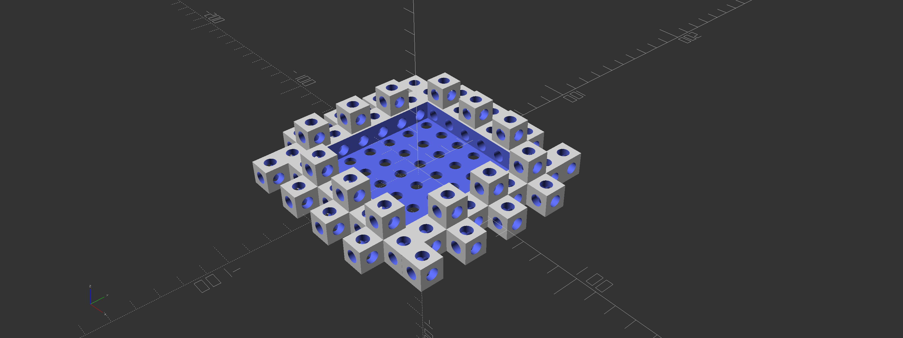

## Table of contents

<!--ts-->
   * [About](#about)
      * [Overview](#overview)
      * [Note From The Developer](#note-from-the-developer)
      * [Main Points](#main-points)
   * [Installation](#installation)
      * [Linux Installation](#linux-installation)
      * [MacOS Installation](#macos-installation)
      * [Windows Installation](#windows-installation)
      * [Docker Installation](#docker-installation)
   * [Getting Started](#getting-started)
   * [Generating Output](#generating-output)
      * [Generated Workspace Directory](#generating-workspace-directory)
      * [Running openscad](#running-openscad)
   * [3D Printing](#3d-printing)
      * [Running Cura - Rough Overview](#running-cura-rough-overview)
   * [Concepts](#concepts)
      * [system-codes](#system-codes)
      * [family-codes](#family-codes)
      * [type-codes](#type-codes)
      * [schemas](#schemas)
   * [Community](#community)
     * [Roadmap](#roadmap)
     * [Contributing](#contributing)
     * [FAQs](#faqs)
     * [Contacts](#contacts)
     * [Acknowledgments](#acknowledgments)
<!--te-->


# About

μpy or mupy is a shorthand for python manufacturing utility and reffers to a new system development technology implemented in the form of a python pip installable package. The μpy package essentially proposes to the open source community in the form of a powerful tool, a model for designing, distributing and manufacturing technology with an emphasis on community, modularity, decentralization, scaling, customization, parametrization, encodability and certification. 


## Overview

It is difficult to explain the full scope of this packages capabilities (both current and intended) but this overview paints a fairly simple picture of the general process a user may adopt. 

### Program some code

1. Import the mupy library

```python

import mupy.core as mu

```

2. Set up workspace directory

```python
workspace_name = "custom_box"
workspace = mu.WorkSpace(str(Path.home())+"/"+workspace_name) # Creates workspace directory relative to home path.

```

3. Defines hardware by name and system-code. 


```python
panel_a = mu.Hardware("panel_a", "CUBX0177-BPAN-B25SR2P5-X8Y8P18-RT-SX25Y25-X8Y8-X20Y20Z5")
panel_b = mu.Hardware("panel_b", "CUBX0177-BPAN-B25SR2P5-X8Y8P18-RT-SX25Y25-X8Y8-X20Y20Z5")
panel_c = mu.Hardware("panel_c", "CUBX0177-BPAN-B25SR2P5-X8Y8P18-RT-SX25Y25-X8Y8-X20Y20Z5")
panel_d = mu.Hardware("panel_d", "CUBX0177-BPAN-B25SR2P5-X8Y8P18-RT-SX25Y25-X8Y8-X20Y20Z5")
panel_e = mu.Hardware("panel_e", "CUBX0177-BPAN-B25SR2P5-X8Y8P18-RT-SX25Y25-X8Y8-X20Y20Z5")
panel_f = mu.Hardware("panel_f", "CUBX0177-BPAN-B25SR2P5-X8Y8P18-RT-SX25Y25-X8Y8-X20Y20Z5")

```
or you can import an stl filelocally or remotely with a url.

```python
panel_a = mu.Hardware("panel_a", "CUBX0177-BPAN-B25SR2P5-X8Y8P18-RT-SX25Y25-X8Y8-X20Y20Z5")
panel_b = mu.Hardware("panel_b", "CUBX0177-BPAN-B25SR2P5-X8Y8P18-RT-SX25Y25-X8Y8-X20Y20Z5")
panel_c = mu.Hardware("panel_c", "CUBX0177-BPAN-B25SR2P5-X8Y8P18-RT-SX25Y25-X8Y8-X20Y20Z5")
panel_d = mu.Hardware("panel_d", "CUBX0177-BPAN-B25SR2P5-X8Y8P18-RT-SX25Y25-X8Y8-X20Y20Z5")
panel_e = mu.Hardware("panel_e", "CUBX0177-BPAN-B25SR2P5-X8Y8P18-RT-SX25Y25-X8Y8-X20Y20Z5")
panel_f = mu.Hardware("panel_f", "CUBX0177-BPAN-B25SR2P5-X8Y8P18-RT-SX25Y25-X8Y8-X20Y20Z5")

```

4. Define initial and final coordinates within an assembly epoch.

```python


panel_a_assembly_coords = mu.Coordinates(0,1,[0, 0 , 8 * 15 / 2 + 210],[0, 0 , 8 * 15 / 2],[0,0,0],[0,0,0])
panel_b_assembly_coords = mu.Coordinates(0,1,[0, 20 * 15 / 2 + 210, 0],[0, 20 * 15 / 2, 0],[0,0,0],[-90,0,0]) 

```

5. Defines assembly

```python
alpha = 200 
chamber_assembly = mu.Assembly("chamber_assembly")
chamber_assembly.include(panel_a, Coordinates(0,1,[0, 0 , 8 * 25 / 2 + alpha],[0, 0 , 8 * 25 / 2 ],[0,0,1000],[0,0,0]))
chamber_assembly.include(panel_b, Coordinates(0,1,[0, 8 * 25 / 2 + alpha, 0],[0, 8 * 25 / 2, 0],[0,0,1000],[-90,0,0]))
chamber_assembly.include(panel_c, Coordinates(0,1,[ - 8 * 25 / 2 - alpha, 0, 0 ],[ - 8 * 25 / 2, 0, 0 ],[0,0,1000],[0,-90,0]))
chamber_assembly.include(panel_d, Coordinates(0,1,[0 , 0, -8 * 25 / 2 - alpha],[0 , 0, -8 * 25 / 2 ],[0,0,1000],[0,180,0]))
chamber_assembly.include(panel_e, Coordinates(0,1,[0, - 8 * 25 / 2 - alpha, 0 ],[0, - 8 * 25 / 2, 0 ],[0,0,1000],[90,0,0]))
chamber_assembly.include(panel_f, Coordinates(0,1,[8 * 25 / 2 + alpha, 0 , 0],[8 * 25 / 2, 0 , 0],[0,0,1000],[90,0,90]))
```

6. Run assembly

```python
workspace.run(chamber_assembly, Coordinates(0,1,[0,0,0],[0,0,0],[0,0,0],[0,0,0]))

```

### Simulate assembly

Once this script is run, it will generate a workspace directory with generated scad source code files. These files build a hierarchical stucture for defining the overall assembly. This breaks things into steps with no specific order. These files are marked with an 'A' or a 'P' at the beginning of thier hash in the file name to signify an assembly or a hardware part respectivly. This code is used to render stl files and then import them into an assembly hierarchy which can be simulated from any point in the assembly. Just click on intended assembly .scad file.


This example gives users the resources to construct a simple box. This example utilizes the CUBX0177 family and the mupy.core library. For this script, modular principles are employed however generally speaking system codes only fit with other certain system codes. In the case of the CUBX0177 family the first five elements composing the system code strings should be synchronized for modularity to be possible. Keep in mind that every type code has its own rules that it must follow and in some cases specific parameterization choices will override other intended features. In other cases the systems codes won't even be meaningful geometrically unless the libraries have built in their own boundary conditions to keep certain codes un-renderable.

### Print Parts

To print parts just import the generated stl file into [Ultimaker Cura](https://ultimaker.com/software/ultimaker-cura) and proceed with setting up your 3D-print configuration. In general all 3D-printed parts require configuration so be sure to familiarize yourself with the process. [This video runs through the process quite well](https://www.youtube.com/watch?v=T-Z3GmM20JM)

### Clean Parts
Depending on the part, you may need to clean it for it to be functionable. This is not always the case and many of the parts mupy provides do not render any wasted filiment to begin with but this is not the general case when 3D-printing.

### Assemble parts

So this is the fun part. You assemble the printed parts and make sure they fit all together. Good Luck!


## Note from the developer

Let me be the first to say that this system is rudimentary, crude, over-engineered in some aspects while under-engineered in others. It's littered with innefficiencies and design principle violations but despite all this it is extremely powerful in the right hands. The intentions behind this system are difficult to explain but in the most basic sense I needed a tool that could handle higher order levels of design, complexity, size and control in all aspects in the domain of science, engineering, manufacturing, design and distribution. It will make more sense once you use it. Good luck.

## Main Points
A collection or list of quick concepts, items and keywords which give an overview of whats mupy is all about.

### What is it?

Originally this project could of been thought of as an attempt to create a physical analogy to a software programming language ; a hardware assembly language, and it was treated as such for a time but eventually as even more abstractions and degrees of freedom were built in the hardware assembly language interpretation became not entirely appropriate. Upon further realizations about the nature about manufacturing and development set in, new concepts and tools to make eveything work. Additionally since openscad is an intimidating language due to the requirements of mathematics and programming knowledge it is not unreasonable to expect that it's popularity would not be matched by it's power so it made sense to build a system that would extend it's capability to others. It's best to think of mupy as a

- Creation Engine

- Knowledge Transfer Mechanism

- Supply Chain Mechanism

- Compression Algorithm

- Decentralized Innovation Utility

- 3D Part Generator & Library

- Applications-Programming & Command-Line Interface

- Horizontal abstraction library for openscad programming

### How do I use mupy?

There are two main interfaces for mupy, a command line interface (CLI) and an applications programming interface (API) They are described below.

- mucli - This is the manufacturing utility command line tool and is used to express the most rudimentary function of mupy ; to quickly render manufacturing resources from known system-code.

- mu.core - This library represents the general case for mupy use-case.

    - python3 scripting interface.

    - hardware class objects combine system-codes and names.

### What are mupy's functions?

- Hardware Generation

- Physical / Mechanical System Simulation

  - Operation
  - Assembly

- Physical / Mechanical System Configuration
- Software Generation

  - Generates openscad code
  - Generates directory structures
  - system-codes are a seed to generate digital-twin

- Python Library

  - Grants greater automation capabilities & empowers users with computing-based augmentations to mupy system-code technology
  - Allows other 3rd-party libraries and python functions to interact with mupy.core functions
  - Only utilizes standard python library

- CLI (command-line-tool)

  - system-code receiver
  - expresses prime function

- High Integrity Modularity Hardware Repository

  - These parts grant fast prototyping
  - modular families can be developed to optimize a specific intended assembly or design of larger system
  - General purpose modular hardware for printing and prototyping

- Complex Physical System Encoder/Decoder/Distribution/Manufacturing Engine

    - Hardware is identified, described or generated using system-codes (short human-readable alphanumeric codes).
    - 3D print systems in many cases, material independent or material specified.

- Complex Physical System Certification

    - Like a package manager but configured for mupy requirements so that family codes provide permutations from scad parametrization.

- Creation Engine

    - General purpose utility for many research and development needs.


### What are the goals of mupy
mupy looks to solve problems, not assert compliance to it's users so consider that it exists in the form as a well organized implementation (through multiple iterations of rewrite) of a script vault which is contained with functions that handle some specific use-case problem set. mupy in its current form is in it's infancy and littered with limitations which are hard to overcome without a community. In its current form it is tailored to 3D printers due to the 

- Minimize development & manufacturing time

- Minimize development & manufacturing cost

- Minimize development & manufacturing risk

- Minimize development & manufacturing energy

- Maximize development & manufacturing output

- Maximize development & manufacturing value

- Maximize development & manufacturing predictability

- Maximize development & manufacturing potential


# Installation

If you are a 3D printer enthusiast, wood worker, developer, artist, inventor, entrepreneur looking for an internal utility to manage your projects then mupy is for you.


## Linux Installation

### Prerequisites

1. Install openscad ( openscad programming language )

```console
$ apt install openscad
```

2. Install python3-pip ( python package manager )
```console
$ apt install python3-pip
```

3. Install git (if you plan to contribute or install by cloning) - Follow instructions at https://www.atlassian.com/git/tutorials/install-git
```console
$ sudo apt-get update 
```
```console
$ sudo apt-get install git
```

### Install mupy

1. Install mupy from the python3 package-manager.
```console
$ pip3 install mupy
```

## MacOS Installation
* There are non-trivial issues associated with this installation. MacOS makes it very difficult to install openscad on certain versions such as Montery, because of verification protocols implemented by apple. This is unfortuneate because at this time mupy essentially wries scad code but requires an instance of the installation to function. My apologies.
### Prerequisites
Open the MacOS terminal and run the following commands:

1. Install homebrew  
```console
% ruby -e "$(curl -fsSL https://raw.githubusercontent.com/Homebrew/install/master/install)" brew doctor
```
    
2. Set python as an environmental variable. 
```console
% export PATH="/usr/local/opt/python/libexec/bin:$PATH"
```

3. Install git (if you plan to contribute or install by cloning)
```console
% brew install git
```

4. Install python3 and pip3 (https://docs.python-guide.org/starting/install3/osx/)
```console
% brew install python3
```
5. Post-install routine.   
```console
% brew postinstall python3
```

6. Install openscad - Follow instructions at https://openscad.org/downloads.html or https://ports.macports.org/port/openscad/

### Install mupy

1. Install mupy from the python3 package-manager.
```console
% pip3 install mupy
```
## Windows Installation

### Prerequisites

1. Install Python3 & pip3

  Navigate to https://www.python.org/downloads/ and follow install instructions.
    
2. Install git (if you plan to contribute or install by cloning)

  Navigate to https://gitforwindows.org/ and follow install instructions.

3. Install openscad

  Navigate to https://openscad.org/downloads and follow install instructions.

### Install mupy

1. Install mupy from the python3 package-manager.

```console
> pip3 install mupy
```

## Docker Installation

If you prefer to use the provided docker image you will need to install docker at https://docs.docker.com/get-docker/ .

1. Build image
```console
$ docker build -t mu .
```

2. Run container
```console
$ docker run -i mu:latest
```

3. SSH into container
```console
$ docker exec -it mu:latest /bin/bash
```

    
# Getting Started

## Manufacturing Utility Command-Line-Tool (mucli)

μpy comes with it bundled a command-line-interface application known as mucli or mucli-tool and behaves much like a linux terminal except that it only accepts special strings known as 'system-codes'. mucli was developed to express to users μpy's most rudimentary operation ; dispensing manufacturing resources for a given system-code. To enter mucli, in the linux terminal, navigate to the mucli directory in the project folder

```console
$ python3 <package_location>/mupy/mucli/mucli.py 
```

- system codes are fundamental to the mupy model and are explained further below. They are essentially used to rapidly development parts and systems from already authored libraries. The system codes contain parametrization data and can be read/write by the human.

### Imputing a system-code

Each system-code corresponds to a specific part. Once typed press enter to generate resources. Here are some examples of system-codes and their corresponding hardware elements.

    μ:# CUBX0006-BLK-L1000W200H15


    μ:# CRSPGR022-SG-M1-T34W8-P15H15-B4-T


    μ:# CUBX0177-BPAN-B12SR3-X10Y10PP12-RT-SX10Y10-X1Y1-XO0YO0-X70Y70Z10-S



    μ:# CUBX0006-BLK-L1229P4W38H89


    μ:# CUBX0177-BPAN-B12SR0-X6Y18PP12-XF-SX10Y10-X1Y1-XO0YO0-X24Y168Z25-S


    μ:# CUBX0177-AXLE-B10SR2P5-A22


    μ:# CUBX0177-FYAD-B15SR3P1


    μ:# CUBX0177-AXAD-B15SR3P1


    μ:# CRSPGR022-BG-M2-T34W25-P25H20C50-B15


## Scripting with mupy.core

### custom_box.py

The script below 'custom_box.py' is a modification of the previous 'simple_box.py'. Below is an example of parametrization being applied on a higher level using python; now the variables which plug into system codes can be configured at the script level and it makes things easier when you want a customize certain aspects of the assembly you're designing in a quick fashion. The hope is that we can as a community identify and build new family codes and schemas.

```python
#!/usr/bin/env python3

"""
Note to user : This script as seen on github is used to illustrate the power of mupy parametrization and how it can be manipulated with python calls.
"""

""" Required Libray Imports. """
from pathlib import Path # Imports library necessary for fetching terminal path information.
import mupy.core as mu # Imports mupy library.

""" Set Up Workspace. """
workspace_name = "custom_box" # Workspace name ; this will be the name of the workspace directory.
workspace = mu.WorkSpace(str(Path.home())+"/"+workspace_name) # Creates workspace.

""" Set Up Workspace. """
unit_block_length = 15 # The CUBX0177 family contains a unit_block_length parameter.
shaft_radius = 3 # The CUBX0177 family contains a shaft_radius parameter which makes reference to a shaft radius within each unit block in the x,y and zed dimensions.

""" Defines the dimensions of the total custom box.in units of unit_bock_length. """
box_x_units = 8 # Defines the count of 'block units' in the x dimension that make up custom box.
box_y_units = 20 # Defines the count of 'block units' in the y dimension that make up custom box.
box_z_units = 12 # Defines the count of 'block units' in the z dimension that make up custom box.

""" Defines the dimensions of the individual panels making up the custom box which are themselves derived from the box dimensions defined in units of unit_bock_length. """
panel_a_x_block_units = box_x_units # Equation must be satisfied in order to express custom-box function. 
panel_a_y_block_units = box_y_units # Equation must be satisfied in order to express custom-box function. 
panel_b_x_block_units = box_x_units # Equation must be satisfied in order to express custom-box function. 
panel_b_y_block_units = box_z_units # Equation must be satisfied in order to express custom-box function. 
panel_c_x_block_units = box_z_units # Equation must be satisfied in order to express custom-box function. 
panel_c_y_block_units = box_y_units # Equation must be satisfied in order to express custom-box function. 
panel_d_x_block_units = box_x_units # Equation must be satisfied in order to express custom-box function. 
panel_d_y_block_units = box_y_units # Equation must be satisfied in order to express custom-box function. 
panel_e_x_block_units = box_x_units # Equation must be satisfied in order to express custom-box function. 
panel_e_y_block_units = box_z_units # Equation must be satisfied in order to express custom-box function. 
panel_f_x_block_units = box_y_units # Equation must be satisfied in order to express custom-box function. 
panel_f_y_block_units = box_z_units # Equation must be satisfied in order to express custom-box function. 

""" Define Hardware Components"""
panel_a = mu.Hardware("panel_a", "CUBX0177-BPAN-B"+str(unit_block_length)+"SR"+str(shaft_radius)+"-X"+str(panel_a_x_block_units)+"Y"+str(panel_a_y_block_units)+"PP2-RF-SX5Y3-X1Y1-XO0YO0-X30Y30Z20-S") # Constructs panel : This hardware component is a box panel of a CUBX0177 class hardware component. This CUBX0177 component
panel_b = mu.Hardware("panel_b", "CUBX0177-BPAN-B"+str(unit_block_length)+"SR"+str(shaft_radius)+"-X"+str(panel_b_x_block_units)+"Y"+str(panel_b_y_block_units)+"PP2-RF-SX5Y3-X1Y1-XO0YO0-X30Y30Z20-S") # Constructs panel A
panel_c = mu.Hardware("panel_c", "CUBX0177-BPAN-B"+str(unit_block_length)+"SR"+str(shaft_radius)+"-X"+str(panel_c_x_block_units)+"Y"+str(panel_c_y_block_units)+"PP2-RF-SX5Y10-X1Y1-XO0YO0-X30Y30Z20-S")
panel_d = mu.Hardware("panel_d", "CUBX0177-BPAN-B"+str(unit_block_length)+"SR"+str(shaft_radius)+"-X"+str(panel_d_x_block_units)+"Y"+str(panel_d_y_block_units)+"PP2-RF-SX5Y10-X1Y1-XO0YO0-X30Y30Z20-S")
panel_e = mu.Hardware("panel_e", "CUBX0177-BPAN-B"+str(unit_block_length)+"SR"+str(shaft_radius)+"-X"+str(panel_e_x_block_units)+"Y"+str(panel_e_y_block_units)+"PP2-RF-SX5Y5-X1Y1-XO0YO0-X30Y30Z20-S")
panel_f = mu.Hardware("panel_f", "CUBX0177-BPAN-B"+str(unit_block_length)+"SR"+str(shaft_radius)+"-X"+str(panel_f_x_block_units)+"Y"+str(panel_f_y_block_units)+"PP2-RF-SX5Y5-X1Y1-XO0YO0-X30Y30Z20-S")

""" Define Hardware Components"""
alpha = 200 # Equation must be satisfied in order to express custom-box function. Alpha is a constant which is useful for describing the distance between panels in the custom box.

panel_a_assembly_coords = mu.Coordinates(0,1,[0, 0 , box_z_units * unit_block_length / 2 + alpha],[0, 0 , box_z_units * unit_block_length / 2],[0,0,0],[0,0,0]) # Equation must be satisfied in order to express custom-box function. 
panel_b_assembly_coords = mu.Coordinates(0,1,[0, box_y_units * unit_block_length / 2 + alpha, 0],[0, box_y_units * unit_block_length / 2, 0],[0,0,0],[-90,0,0]) # Equation must be satisfied in order to express custom-box function. 
panel_c_assembly_coords = mu.Coordinates(0,1,[ - box_x_units * unit_block_length / 2 - alpha, 0, 0 ],[ - box_x_units * unit_block_length / 2, 0, 0 ],[0,0,0],[0,-90,0]) # Equation must be satisfied in order to express custom-box function. 
panel_d_assembly_coords = mu.Coordinates(0,1,[0 , 0, - box_z_units*unit_block_length / 2 - alpha],[0 , 0, - box_z_units*unit_block_length / 2],[0,0,0],[0,180,0]) # Equation must be satisfied in order to express custom-box function. 
panel_e_assembly_coords = mu.Coordinates(0,1,[ 0, - box_y_units * unit_block_length / 2 - alpha, 0 ],[ 0, - box_y_units * unit_block_length / 2, 0 ],[0,0,0],[90,0,0]) # Equation must be satisfied in order to express custom-box function. 
panel_f_assembly_coords = mu.Coordinates(0,1,[ box_x_units * unit_block_length / 2 + alpha, 0 ,0 ],[ box_x_units * unit_block_length / 2, 0 ,0 ],[0,0,0],[90,0,90]) # Equation must be satisfied in order to express custom-box function. 

""" Define assembly. """
box_assembly = mu.Assembly("box_assembly")
box_assembly.include(panel_a, panel_a_assembly_coords)
box_assembly.include(panel_b, panel_b_assembly_coords)
box_assembly.include(panel_c, panel_c_assembly_coords)
box_assembly.include(panel_d, panel_d_assembly_coords)
box_assembly.include(panel_e, panel_e_assembly_coords)
box_assembly.include(panel_f, panel_f_assembly_coords)

""" Run """
workspace.run(box_assembly, mu.Coordinates(0,1,[0,0,0],[0,0,0],[0,0,0],[0,0,0])) # This command creates all directorires and assemblies.

```

### custom-box.py Simulation


### double_box.py
The double_box script was designed to illustrate basic encapsuation priciples expressed by assembly objects. Essentially assembly objects are in many ways just like hardware objects becasue they can both be includied in a workspace or assembly and they can both be assigned coordinates. The only difference is that assemblies do not  possess system codes (yet) instaed they are just consided collections of sub-system-coes and thier corresonding coordinet sets. The other difference is that primitive hardware components are built from openscad wheras assembllies withien  thier respective 'workspace' are built by python scripts. This is not a rule as much as it is a trend. 
```python

#!/usr/bin/env python3

"""
Note to user : This script as seen on github is used to illustrate the power of mupy parameterization and how it can be manipulated with python calls.
"""

""" Required Libray Imports. """
from pathlib import Path # Imports library nessecary for fetching terminal path information.
import mupy.core as mu # Imports mupy library.

""" Set Up Workspace. """
workspace_name = "double_box" # Workspace name ; this will be the name of the workspace directory.
workspace = mu.WorkSpace(str(Path.home())+"/"+workspace_name) # Creates workspace.

""" Define Hardware Components"""
panel_a = mu.Hardware("panel_a", "CUBX0177-BPAN-B25SR2P5-X8Y8PP2-RT-SX10Y10-X1Y1-XO0YO0-X70Y70Z10-S")

panel_a.color = "blue"

panel_b = mu.Hardware("panel_b", "CUBX0177-BPAN-B25SR2P5-X8Y8PP2-RT-SX10Y10-X1Y1-XO0YO0-X70Y70Z10-S")
panel_c = mu.Hardware("panel_c", "CUBX0177-BPAN-B25SR2P5-X8Y8PP2-RT-SX10Y10-X1Y1-XO0YO0-X70Y70Z10-S")
panel_d = mu.Hardware("panel_d", "CUBX0177-BPAN-B25SR2P5-X8Y8PP2-RT-SX10Y10-X1Y1-XO0YO0-X70Y70Z10-S")
panel_e = mu.Hardware("panel_e", "CUBX0177-BPAN-B25SR2P5-X8Y8PP2-RT-SX10Y10-X1Y1-XO0YO0-X70Y70Z10-S")
panel_f = mu.Hardware("panel_f", "CUBX0177-BPAN-B25SR2P5-X8Y8PP2-RT-SX10Y10-X1Y1-XO0YO0-X70Y70Z10-S")

panel_a.color = "red"

panel_g = mu.Hardware("panel_g", "CUBX0177-BPAN-B25SR2P5-X8Y8PP2-RT-SX10Y10-X1Y1-XO0YO0-X70Y70Z10-S")
panel_h = mu.Hardware("panel_h", "CUBX0177-BPAN-B25SR2P5-X8Y8PP2-RT-SX10Y10-X1Y1-XO0YO0-X70Y70Z10-S")
panel_i = mu.Hardware("panel_i", "CUBX0177-BPAN-B25SR2P5-X8Y8PP2-RT-SX10Y10-X1Y1-XO0YO0-X70Y70Z10-S")
panel_j = mu.Hardware("panel_j", "CUBX0177-BPAN-B25SR2P5-X8Y8PP2-RT-SX10Y10-X1Y1-XO0YO0-X70Y70Z10-S")
panel_k = mu.Hardware("panel_k", "CUBX0177-BPAN-B25SR2P5-X8Y8PP2-RT-SX10Y10-X1Y1-XO0YO0-X70Y70Z10-S")
panel_l = mu.Hardware("panel_l", "CUBX0177-BPAN-B25SR2P5-X8Y8PP2-RT-SX10Y10-X1Y1-XO0YO0-X70Y70Z10-S")

""" Define Hardware Assembly Coordinates"""

alpha = 200 
panel_a_assembly_coords = mu.Coordinates(0.2,0.75,[0, 0 , 8 * 25 / 2 + alpha],[0, 0 , 8 * 25 / 2 ],[0,0,0],[0,0,0]) # Equation must be satisfied in order to express custom-box function. 
panel_b_assembly_coords = mu.Coordinates(0.2,0.75,[0, 8 * 25 / 2 + alpha, 0],[0, 8 * 25 / 2, 0],[0,0,0],[-90,0,0]) # Equation must be satisfied in order to express custom-box function. 
panel_c_assembly_coords = mu.Coordinates(0.2,0.75,[ - 8 * 25 / 2 - alpha, 0, 0 ],[ - 8 * 25 / 2, 0, 0 ],[0,0,0],[0,-90,0]) # Equation must be satisfied in order to express custom-box function. 
panel_d_assembly_coords = mu.Coordinates(0.2,0.75,[0 , 0, -8 * 25 / 2 - alpha],[0 , 0, -8 * 25 / 2 ],[0,0,0],[0,180,0]) # Equation must be satisfied in order to express custom-box function. 
panel_e_assembly_coords = mu.Coordinates(0.2,0.75,[0, - 8 * 25 / 2 - alpha, 0 ],[0, - 8 * 25 / 2, 0 ],[0,0,0],[90,0,0]) # Equation must be satisfied in order to express custom-box function. 
panel_f_assembly_coords = mu.Coordinates(0.2,0.75,[8 * 25 / 2 + alpha, 0 , 0],[8 * 25 / 2, 0 , 0],[0,0,0],[90,0,90]) # Equation must be satisfied in order to express custom-box function. 

panel_g_assembly_coords = mu.Coordinates(0.2,0.75,[0, 0 , 8 * 25 / 2 + alpha],[0, 0 , 8 * 25 / 2 ],[0,0,0],[0,0,0]) # Equation must be satisfied in order to express custom-box function. 
panel_h_assembly_coords = mu.Coordinates(0.2,0.75,[0, 8 * 25 / 2 + alpha, 0],[0, 8 * 25 / 2, 0],[0,0,0],[-90,0,0]) # Equation must be satisfied in order to express custom-box function. 
panel_i_assembly_coords = mu.Coordinates(0.2,0.75,[ - 8 * 25 / 2 - alpha, 0, 0 ],[ - 8 * 25 / 2, 0, 0 ],[0,0,0],[0,-90,0]) # Equation must be satisfied in order to express custom-box function. 
panel_j_assembly_coords = mu.Coordinates(0.2,0.75,[0 , 0, -8 * 25 / 2 - alpha],[0 , 0, -8 * 25 / 2 ],[0,0,0],[0,180,0]) # Equation must be satisfied in order to express custom-box function. 
panel_k_assembly_coords = mu.Coordinates(0.2,0.75,[0, - 8 * 25 / 2 - alpha, 0 ],[0, - 8 * 25 / 2, 0 ],[0,0,0],[90,0,0]) # Equation must be satisfied in order to express custom-box function. 
panel_l_assembly_coords = mu.Coordinates(0.2,0.75,[8 * 25 / 2 + alpha, 0 , 0],[8 * 25 / 2, 0 , 0],[0,0,0],[90,0,90]) # Equation must be satisfied in order to express custom-box function. 


""" Define assembly. """
box_assembly_1 = mu.Assembly("box_assembly_1")
box_assembly_1.include(panel_a, panel_a_assembly_coords) 
box_assembly_1.include(panel_b, panel_b_assembly_coords) 
box_assembly_1.include(panel_c, panel_c_assembly_coords)
box_assembly_1.include(panel_d, panel_d_assembly_coords)
box_assembly_1.include(panel_e, panel_e_assembly_coords)
box_assembly_1.include(panel_f, panel_f_assembly_coords)

box_assembly_2 = mu.Assembly("box_assembly_2")
box_assembly_2.include(panel_g, panel_g_assembly_coords)
box_assembly_2.include(panel_h, panel_h_assembly_coords)
box_assembly_2.include(panel_i, panel_i_assembly_coords)
box_assembly_2.include(panel_j, panel_j_assembly_coords)
box_assembly_2.include(panel_k, panel_k_assembly_coords)
box_assembly_2.include(panel_l, panel_l_assembly_coords)

beta = 1000
box_assembly_1_coords = mu.Coordinates(0.1,0.5,[8 * 25 / 2 + beta,0,0],[8 * 25 / 2,0,0],[0,0,0],[0,0,0]) # Equation must be satisfied in order to express custom-box function. 
box_assembly_2_coords = mu.Coordinates(0.5,0.8,[-8 * 25 / 2 - beta ,0,0],[-8 * 25 / 2,0,0],[0,0,0],[0,0,0]) # Equation must be satisfied in order to express custom-box function. 

system_assembly_1 = mu.Assembly("system_assembly_1")
system_assembly_1.include(box_assembly_1, box_assembly_1_coords) # Coordinates complete!
system_assembly_1.include(box_assembly_2, box_assembly_2_coords) # Coordinates complete!


""" Run """
workspace.run(system_assembly_1, mu.Coordinates(0,1,[0,0,0],[0,0,0],[0,0,0],[0,0,0])) # This command creates all directorires and assemblies.


```
### double-box.py Simulation


# Generating Output
Upon pressing 'enter' by the mucli command line tool or running a workspace with workspace.run() inside a scipt will generate a workspace directory an this will be the entry-point for your IP.

## Generated Workspace Directory
        .
        ├── box_assembly_A1cfc7f.scad
        ├── CUBX0177-BPAN-B15SR3-X12Y20PP2-RF-SX5Y10-X1Y1-XO0YO0-X30Y30Z20-S.scad
        ├── CUBX0177-BPAN-B15SR3-X20Y12PP2-RF-SX5Y5-X1Y1-XO0YO0-X30Y30Z20-S.scad
        ├── CUBX0177-BPAN-B15SR3-X8Y12PP2-RF-SX5Y3-X1Y1-XO0YO0-X30Y30Z20-S.scad
        ├── CUBX0177-BPAN-B15SR3-X8Y12PP2-RF-SX5Y5-X1Y1-XO0YO0-X30Y30Z20-S.scad
        ├── CUBX0177-BPAN-B15SR3-X8Y20PP2-RF-SX5Y10-X1Y1-XO0YO0-X30Y30Z20-S.scad
        ├── CUBX0177-BPAN-B15SR3-X8Y20PP2-RF-SX5Y3-X1Y1-XO0YO0-X30Y30Z20-S.scad
        ├── panel_a_P942313.scad
        ├── panel_b_Pef37ea.scad
        ├── panel_c_P52f602.scad
        ├── panel_d_P49e0f5.scad
        ├── panel_e_P3910d0.scad
        ├── panel_f_Pfe0d99.scad
        ├── scad
        │   └── CUBX0177.scad
        └── stl_files
            ├── CUBX0177-BPAN-B15SR3-X12Y20PP2-RF-SX5Y10-X1Y1-XO0YO0-X30Y30Z20-S.stl
            ├── CUBX0177-BPAN-B15SR3-X20Y12PP2-RF-SX5Y5-X1Y1-XO0YO0-X30Y30Z20-S.stl
            ├── CUBX0177-BPAN-B15SR3-X8Y12PP2-RF-SX5Y3-X1Y1-XO0YO0-X30Y30Z20-S.stl
            ├── CUBX0177-BPAN-B15SR3-X8Y12PP2-RF-SX5Y5-X1Y1-XO0YO0-X30Y30Z20-S.stl
            ├── CUBX0177-BPAN-B15SR3-X8Y20PP2-RF-SX5Y10-X1Y1-XO0YO0-X30Y30Z20-S.stl
            └── CUBX0177-BPAN-B15SR3-X8Y20PP2-RF-SX5Y3-X1Y1-XO0YO0-X30Y30Z20-S.stl


## Running openscad

1. Navigate to workspace directory

```console
$ cd ~/custom_box
```

2. Open 'box_assembly' file

```console
$ openscad box_assembly_A1cfc7f.scad
```

### Animations
 In the openscad IDE, form the toolbar select View -> Animate and under the main view some animation inputs will appear. Select a frame rate and step count to run animation.

### Generating Gifs
I use a utility called ImageMagick and you can learn more about it from Bryan Duxbury's Blog at https://bryanduxbury.com/2014/01/16/creating-animated-gifs-from-openscad/. 

### Modifying generated code
Feel free to modify any scad code for whatever reason you see fit (typically position, angle orother  parameterization) since it is easy enough to regenerate. Keep in mind that the hashes in the filename(s) will change.

# 3D Printing

You will need to download Ultimaker Cura in order to move forward with this step. You can download it at https://ultimaker.com/software/ultimaker-cura .

## Running Cura - Rough Overview

  1. Open Ultimaker Cura

Once downloaded you should take time to familiarize yourself with basic 3D printing concepts. Some common examples include 

- Print Bed Temperature
- Nozzle Temperature
- Retraction State
- Cleaning
- Filament
- Supports 
- Print Speed

Some of these things and more are configurable in in Cura, which can be thought of as a pre-print application which feeds instructions to the 3D printers with the gcode file it generates. For starters try importing an stl file generated from custom_box.py

  2. In the header select File -> Open File(s) to load an object.
  3. Configure position and angle of object by selecting it.
  4. Add any more additional objects that you may want to fit on print bed be repeating steps 1 and 2 ( Make sure the 3D printer model or print-bed size is known and configured by the Cura system. ).
  5. Configure print settings.
  6. Generate gcode file and store on SD drive ( or whatever the 3D printer requires )
  7. 3D Print!

# Concepts

## mupy.core

### Workspace
A workspace is essentially a directory structure or environment to place hardware or assemblies objects into. It is a python class object and possess other unique properties and functions which make it behave as a sort of virtual workbench. Some properties and functions :

  - Ensures hardware & assembly uniqueness within script.
  - Contains a run() function that initializes rendering sequence.
  - Only needs one arguments ; the final assembly.
    - All sub-assemblies and hardware are imported recursively.
  - Manages directory structure. Gives a home to parts which may be numerous.
  - 3D Workbench.

### Hardware
Hardware objects are the primary mechanism for introducing system-codes into the scripting environment.

### Coordinates
In an assembly generally speaking, there needs to exist initial and final coordinates in 3D space within a certain time quantum since the assembly will exist as a hierarchical structure and will need to be organized down into multiple time domains. Keep in mind that multiple assemblies can exist in a single time quantum but not if they ever involve the same part.

### Assembly
Contains similar properties as a Hardware object except that it's primary purpose is to include Hardware objects and other assembly object into itself. It can be injected into other assemblies.
Additionally the assembly object was chosen as the primary mechanism for implementing mu packages.

### Time Quantum


## System Codes
So the whole idea behind a system-code was that it was this thing which would theoretically speed up precision development and deployment in the fastest way deemed conceivable within set requirements. Consider the engineer who wishes to design something and prototype it fast. Instead of employing the usual methods, they can save a great deal of time by programming it into a string ( 16 - 200 characters if we are being conservative ). Ok, ok, ok... its not that simple of-course, the library would need to be authored and certified first and the hard work has arguably already been done at that point however the system-code offers many permutations which have not of been tested before. But what is a system-code?
A system-code is a finite, often short-string representation of a physical part, machine or structure ; anything in principle really. It is technically a seed for the creation of a digital-twin representation of that physical 'system' (generally speaking ; a part, machine or structure or anything deserving of a system-code) and all the information regarding it's operation, assembly, manufacturing, cost and material characteristics to any arbitrary degree of complexity (digital twin exists as a python class object). Moreover tools exist to keep these string representations short and organized within their countless permutations set. Additionally system-codes serve as a name or identifier without physical uniqueness and human readability features keeping things intuitive. A system-code can also be thought of as something which generates resources and metadata that help users manufacture said system at reduced cost. These resources include CAD files and annotated openscad source code directories containing assembly and operational animation routines which help users record and transmit and intepret complex manufacturing and assembly information.

### Properties


- Schema-less : Individual system-codes only are required to share the same schema with system-codes that belong to the same type code.
- Seed-like : system-coded serve as a seed which when processed by mupy.core produces a digital-twin class object which is responsible for the generated code and renderings.
- Constituent-Codes:

    - family-code : Serves as a name-space code. 
    - type-code : Serves as a name-space code.
    - parametrization-code : Serves as the inputs which tune the values the hardware .
    - manufacturing-code : Serves as a name-space code. (Not yet implemented)
    - material-code : Describes Material. (Not yet implemented)


## Family Codes
Family codes serve as a kind of name-space code (it may be changed to a name-space code in time) which references a particular library of scad functions in most cases currently and is always set as the first code within the system-code string separated by a dash ('-'). A family code references a family of possible parts which is into 'types' which usually are of a similar style or framework regarding geometric rules set by the author. Types maintain their own parametrization or schema ; this means that for a given type the schema is specific to that type although it is possible that this rule can be relaxed in time with better programming ; meaning that even types can maintain shifting schemas depending on parametrization choices.

## Type Codes
A system-code serves to identify a general system (literally anything physical, especially technological or worth manufacturing) and generate resources and metadata which help users manufacture said system at reduced cost. These resources include CAD files and annotated openscad source code directories containing assembly and operational animation routines which help users record and transmit and interpret complex manufacturing and assembly information.

## Parametrization Codes

## Schemas
Schemas reference the pattern the system codes obey when storing parametrization information.


### Requirements of mupy

- Needs System-Codes

- Schema-less

- Publishable Package

- Assigned Assembly, Operational & Other Context

- Offers Applications Programming Interface (API)


## Road-map

### Build a community
This kind of thing wont go far without a community. This community would provide real goals, like real projects that can help or train us and mupy or some successor technology to do bigger and better things that could handle infrastructure or high-power innovation. I know it sounds crazy but why not. Lets build a space ship or something. The community may identify worthwhile proposals for features. Consider that the scripting interface makes it easier for people and teams to coordinate larger projects using a version control system like github.

### Redesign model (perhaps in a different language)
All programming all starts with a model. The more efficient the model the more efficient the programming.Every time you rebuild a system from the ground up the developers identify deeper problems which when solved leads to more efficiency. This creates more automation power and longevity. It also keeps the programmers sharp.

### More family codes
More family codes means more parts to print or more possible things to assemble. This has an exponential effect. This will reinforce the integrity of mupy and the likelihood to attract users. Additionally we want to add constraints that keep certified families clean of defunct parts which should not or could not be printed.

### More scripts codes
We need people to request like inventions or something with an emphasis on modular development so that we can assemble advanced systems together. Coordination will need to be had and this means people taking leadership.

### Design a package manager
This is essential. While from the point of view of python itself, mupy could effectivly created packages on it's own with mupy nstalled and for now it is the best we have but eventually it would be extremely beneficial to write mupy scripts which assembly and operational animations built in that are themselves callable as a system-codes. This would give a higher level of abstraction to the creations of the community. It also serves as an additional compression layer saying memory for temporary comute time. 

### Implement name spaces
It is unclear if family codes serve as name spaces but these are essentially needed for implementing some kind of package manager application.
### Implement manufacturing codes

### Implement Material codes
It is important to eventually provide a space for information regarding se part and the material it is created from. In the future mupy will attempt to cover more manufacturing methods other than 3D printing.
### Integrating technologies


### Implement a package manager with authentication
This would represent a better system for managing community-authored-systems. Additionally this would make upy more efficient as well as do a better job to make it more useful for the community.

### Create a community goals / wish list
Lets design a nuclear spacecraft together! Even if we fail imagine what we learn or accomplish on the way! The requirements of such a goal would make mupy very powerful if it were designed to handle those requirements.

### Automated certification routines

This particular function is the golden function which would render this project truly powerful. Automated certification makes reference to the automation of a family code being injected into mupy. This function is desired for several reasons;

  - Family codes themselves are valuable, for each family code hat exists there exists anywhere from millions to quadrillions of permutations of renderings provided by mupy.
  - Scripted assemblies, if parameterized can be certified and this would make any scripted 1000 times as productive.
  - Encoding routines are automatically integrated into terminal.
  - New scad libraries could be integrated.
  - Makes name-space type 

## Contributing

Currently the best form of contribution would be to play offer suggestions for improvement or they could develop scripts to be certified or open scad code to be certified (manually).

### Project Identification
Currently this is the most valuable and important top priority (ongoing) task. This is not a programming or technology task rather it is a task for the visionary or the philosopher but it's the hardest job of all. Where this task fails or succeeds cascades to all other aspects of entire system. This is even more important than the functions or the algorithms which constitute mupy because the algorithms are derived from requirements which are derived from goals but only the greatest but possible goals are worth pursuing because other boons are are found along the way. We need these people to identify what we must build. I am not referring to the sub-components of some bigger system because those developments can be derived from the greater requirements which may exists from the greater requirements. 

### Part Identification
This is similar to the previous except ona primitive scale. So If a project is identified then a new modular family in most cases will be developed to fulfill some requirements fro a design.

### Script Vault
The more systems that are built the better, more they are parameterized and modular the better although that is no requirement. This will make the technology stronger and more useful.

### Improvements and additions to hardware library.
The standard library of parts should be developed more and more over time because these represent the primitive parts which make up the scripted-systems. The are also represented by system-codes but they themselves do not really represent systems so much except in the general sense. More libraries will make the system stronger in time but I would recommend to only design hardware that has been identified as a requirement in a larger system.

### Improvements to mu command-line-tool
Currently the command line tool is extremely crude. The reasons for this are vast but I typically build command line tools in my projects to illustrate basic functionality and prototyping. The mucli tool is no different except that I really like it's overall form in principle. The idea of just typing in  a code to get quick resources is really cool and useful.

### mupy.core
mupy.core should be rebuilt in a couple years after user feedback has been processed and a team is ready to develop.

## Licensing Structure
All subdirectories which contain a license will be represented by that license. This is always a subdirectory representing a family code or namespace. In this way mupy can be thought of as an abstraction that makes efficient calls to some library which may contain a drifferent liscens. Additionally one could protect a library with authentication / prmissions systems. 

### mupy.core license
The top level directory license applies to all contained files and directories EXCEPT for family code files and directories which should be thought of as python sub-packages which always contain their own source code file, license and digital-twin python class. This license overrides the top level license and applies to all same-directory-files and same-directory-directories. The mupy.core serves as an abstraction layer to the hardware family libraries which it essentially makes function calls to containing parametrization which is extracted from system-codes.

### mupy.lib licenses
Individual hardware families are guided by their own license agreements. Each hardware family directory will posses a license file. The mupy package makes calls to these libraries which exist as sub-directories currently.

## FAQ

### Why should I download mucli
If you have a 3D printer it is an absolute must! You can print really great parts.

### How many system-codes are available?
Incalculable, since the family codes define their own rules, it is difficult to measure the permutation count of parts. Currently in mupys infancy there are over a quadrillion parts. 

### Is it free?
Yes! but only the core technology is free, the various family code libraries which should each contain their own license which states the conditions for use. In most cases it is free to use but read the license always.

### Does mupy replace CAD?
Absolutely not, mupy is it's own thing. In some cases it may reduce the hours spent on CAD for people and in other cases it may increase the time people spend. In the future I could see CAD applications integrating a mucli-like application utilities into it to get the best of both worlds.

## Contacts:

| Project Team          | Email                          |
| --------------------- | ------------------------------ |
| Michael C Ryan        | spacetime.engineer@gmail.com   |

<!-- ACKNOWLEDGMENTS -->
## Acknowledgments

* [Openscad Community](https://github.com/openscad/openscad)
* [Python community](https://www.python.org/)
* [PiPy community](https://www.python.org/)
* [Docker community](https://www.docker.com/)
