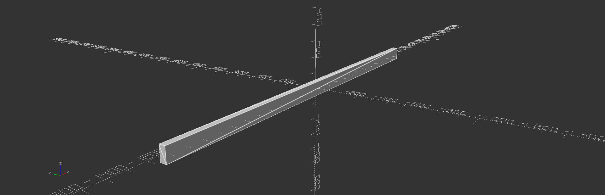

<!-- TABLE OF CONTENTS -->
<details>
  <summary>Table of Contents</summary>
  <ol>
    <li><a href="#About">About</a></li>
    <li>
      <a href="#Getting-Started">Getting Started</a>
      <ul>
        <li><a href="#linux-installation">Linux Installation</a></li>
        <li><a href="#windows-installation">Windows Installation</a></li>
        <li><a href="#macos-installation">MacOS Installation</a></li>
        <li><a href="#installation">Installation</a></li>
        <li><a href="#prerequisites">Prerequisites</a></li>
        <li><a href="#installation">Installation</a></li>
      </ul>
    </li>
    <li><a href="#usage">Usage</a></li>
    <li><a href="#roadmap">Roadmap</a></li>
    <li><a href="#contributing">Contributing</a></li>
   <li>
      <a href="#Liscense">Getting Started</a>
      <ul>
        <li><a href="#mupy">Prerequisites</a></li>
        <li><a href="#familycode">Installation</a></li>
      </ul>
    </li>
    <li><a href="#contacts">Contact</a></li>
    <li><a href="#acknowledgments">Acknowledgments</a></li>
  </ol>
</details>


# About

μpy or mupy is a shorthand for python manufacturing utility and reffers to a new system development technology implemented in the form of a python pip installable package. The μpy package essentially proposes to the open source community in the form of a powerful tool, a model for designing, distributing and manufacturing technology with an emphasis on community, modularity, decentralization, scaling, customization, parametrization, encodability and certification. Currently mupy contains rendereings for quadrilions of parts for 3D print and exponentially more can become available with the help of users in the future.

### Note from the developer

This package is not without it's shortcomings but there is something very real and very powerful here. I didnt originally build this for the community, rather it was set of requirements that was fufilled. I built this for myself because needed a tool that would do exactly what I needed it to do.

- Suffers Scope Creep with is why the model must be redesigned but this time by a community which has learned lessons from the previuous iteration. Model is roulghy well defined.
- Open scad is not integrated in, rather mupy is a library that writes openscad code. 
- Each hardware family contains its own rules.
- Many clauses which began the effort were eventually violated.

# Overview

- Import the mupy library

```python

import mupy.core as mu

```

Set up a workspace

```python
workspace_name = "custom_box"
workspace = mu.WorkSpace(str(Path.home())+"/"+workspace_name) # Creates workspace directory relative to home path.

```

Defines hardware by name and system-code. System-codes have many permutations and should be thought of as encoded parameterizations for scad function calls.

```python
panel_a = mu.Hardware("panel_a", "CUBX0177-BPAN-B25SR2P5-X8Y8P18-RT-SX25Y25-X8Y8-X20Y20Z5")
panel_b = mu.Hardware("panel_b", "CUBX0177-BPAN-B25SR2P5-X8Y8P18-RT-SX25Y25-X8Y8-X20Y20Z5")

```

Defines initial and final coordinates of hardware in 3D space within a single assembly epoch.

```python


panel_a_assembly_coords = mu.Coordinates(0,1,[0, 0 , 8 * 15 / 2 + 210],[0, 0 , 8 * 15 / 2],[0,0,0],[0,0,0])
panel_b_assembly_coords = mu.Coordinates(0,1,[0, 20 * 15 / 2 + 210, 0],[0, 20 * 15 / 2, 0],[0,0,0],[-90,0,0]) 

```

Defines assembly

```python
assembly_0 = mu.Assembly("box_assembly")
assembly_0.include(panel_a, panel_a_assembly_coords)
assembly_0.include(panel_b, panel_b_assembly_coords)

```

Run assembly

```python
assembly_0 = mu.Assembly("box_assembly")
assembly_0.include(panel_a, panel_a_assembly_coords)
assembly_0.include(panel_b, panel_b_assembly_coords)

```


### Why build mupy

- To give the community access to quadrillions of 3D printable parts and counting. These parts are for recreation, utility and economic development. The large number of parts are available through the various permutations of parameterized scad functions that build 3D shapes and are referenced or identified by system-codes. 

    - System Code Example : CUBX0006-BLK-L1000W50H200

- To design complex assemblies with said parts in a scripting format.

- To render simulations and manufacturing resources from system-codes directly

    - Everything terminates at a system code.

    - Data compression is achieved through abstraction tecquniques.

- To assign system-encodings, system-schemas and system-parameterizations to organically designed systems and hardware

    - Grants customization

    - Grants Recall

- To give inventors, makers, engineers and artists a more powerful platform for distribution and where thier liscens is respected.

    - Start a business

    - Build a portal gun

    - Start a private project with peers

    - Sell stuff on Etsy

    - Take the parts and keep all your f*cking money


### How does it work?

There are two main interfaces for mupy, a command line interface (CLI) and an applications programming interface (API) They are described below.

- mucli - This is the manufacturing utility command line tool and is used to express the most rudimetry function of mupy ; to quickly render manufacturing resources from known system-code.

- mu.core - This library represents the general case for mupy use-case.

    - python3 scripting interface.

    - hardware class objects combine system-codes and names.

### Function

- Simulation

    - Simulate operation.

    - Simulate assembly.

    - Simulate manufacturing. (Advanced topic)

- Configuration

    - Giving users higher levels of configuration through abstraction tecquniques.

- Customization

- Modularity

    - Countless parts available for render and in many cases parts interlock.
    
    - modularity makes assebly and manufacturing cheaper and quicker to scale.
    
    - Will help build efficiency of scale designs.

- Encodability

    - Hardware identified and described with system-codes.

- Distribution

    - New system codes and family codes can be provided by contributers.

- Manufacturing

    - 3D print systems in many cases, material independent or material specified.
    
- Context

    - Manufacturing context
    - Assembly context
    - Material context
    - Indentity context
    
- Certification

    - Like a package manager but configured for mupy requirements so that family codes provide permutations from scad parameterization.

- R & D

    - General purpose utility for many research and development needs.

### Form

- Horizontal abstraction layer 

    - Makes calls to pre-written openscad functions with parameterization

- Python Pip Package

    $ pip3 install mupy

- Command Line Interface

    $ ./mucli

- Application Programming Interface

    import mupy.core as mu

- System schematic library

    - Pre-installed 

- part generator

- system generator (advanced)

- system oriented data compression / abstraction engine

    - Small package, quadrillions of parts sofar.

### Goals

- increase development speed

- reduce development cost

- decentralized manufacturing

    - manufacture forks and guitar picks

    - manufacture toasters and quantum computers

- massive scale system development

- system schematic database

- expose programmers to mechanical engineering

- expose mechanical engineers to programming

- decentralized research and development


### Structure

    ├── Dockerfile
    ├── examples
    │   ├── app.py
    │   └── utility_box.py
    ├── LICENSE
    ├── MANIFEST.in
    ├── mupy
    │   ├── assembly.py
    │   ├── coordinates.py
    │   ├── core.py
    │   ├── decode.py
    │   ├── hardware.py
    │   ├── __init__.py
    │   ├── lib
    │   │   ├── CRSPGR022
    │   │   │   ├── crspgr022.py
    │   │   │   ├── __init__.py
    │   │   │   ├── README.md
    │   │   │   └── scad
    │   │   │       └── CRSPGR022.scad
    │   │   ├── CUBX0006
    │   │   │   ├── cubx0006.py
    │   │   │   ├── __init__.py
    │   │   │   ├── LICENSE
    │   │   │   ├── README.md
    │   │   │   └── scad
    │   │   │       └── CUBX0006.scad
    │   │   ├── CUBX0177
    │   │   │   ├── cubx0177.py
    │   │   │   ├── __init__.py
    │   │   │   ├── LICENSE
    │   │   │   ├── README.md
    │   │   │   └── scad
    │   │   │       └── CUBX0177.scad
    │   │   ├── __init__.py
    │   │   └── README.md
    │   ├── mucli
    │   │   ├── __init__.py
    │   │   ├── input_branch.py
    │   │   ├── mucli.py
    │   │   └── selection_branch.py
    │   ├── README.md
    │   └── workspace.py
    ├── mupy.toml
    ├── Pipfile
    ├── Pipfile.lock
    ├── README.md
    ├── resources
    │   ├── CUBX0006-BLK-L1000W200H15.png
    │   └── utility_box.gif
    └── setup.py


# Installation

If you are a 3D printer enthusist, wood worker, developer, artist, inventor, entrepreneur looking for an internal utility to manage your projects then mupy is for you.


## Linux Installation

### Prerequisites

1.) Install openscad ( openscad programming language )

    apt install openscad

2.) Install python3-pip ( python package manager )

    apt install python3-pip

3.) Install git (if you plan to contribute or install by cloning) - Follow instrucations at https://www.atlassian.com/git/tutorials/install-git

    $ sudo apt-get update 
    
    $ sudo apt-get install git

### Install mupy

1.) Install mupy from the python3 package-manager.

    pip3 install mupy

## MacOS Installation

### Prerequisites

1.) Install homebrew  
    
    $ ruby -e "$(curl -fsSL https://raw.githubusercontent.com/Homebrew/install/master/install)" brew doctor
    
2.) Set python as an enviornmental varible. 

    $ export PATH="/usr/local/opt/python/libexec/bin:$PATH"
    
3.) Install git (if you plan to contribute or install by cloning)

    $ brew install git
    
4a.) Install python3 and pip3 (https://docs.python-guide.org/starting/install3/osx/)

    $ brew install python3

4b.) Post-install routine.   

    $ brew postinstall python3

5.) Install openscad - Follow instructions at https://openscad.org/downloads.html or https://ports.macports.org/port/openscad/

### Install mupy

1.) Install mupy from the python3 package-manager.

    pip3 install mupy

## Windows Installation

### Prerequisites

1.) Install Python3 & pip3

    Navigate to https://www.python.org/downloads/
    
3.) Install git (if you plan to contribute or install by cloning)

    Navigate to https://gitforwindows.org/
    apt install openscad

### Install mupy

1.) Install mupy from the python3 package-manager.

    pip3 install mupy

## Docker Container ( optional )

If you prefer touse the provided docker image you will need to install docker at https://docs.docker.com/get-docker/ .

### Build image

    $ docker build -t mu .

### Run container

    $ docker run -i mu:latest


### SSH into container

    $ docker exec -it mu:latest /bin/bash


    
# Getting Started

## mucli

μpy comes with it bundled a command-line-interface application known as the mucli and behaves much like a linux terminal except that it only accepts special strings known as 'system-codes'. mucli was developed to express to users μpy's most rudimetry operation ; dispensing manufacturing resources for a given system code. To enter mucli, in the linux terminal

    :~$ ./mucli 


### Enter system-code
The mucli is a general purpose utility and represents the most rudimetry operation of the mupy technology ; if you enter a code and it responds with system resources, schematics and renderings. An example..

    μ:# CUBX0006-BLK-L1000W200H15


    μ:# CUBX0006-BLK-L2438P4W38H89



    μ:# CUBX0006-BLK-L1000W200H15

    μ:# CUBX0006-BLK-L1000W200H15

    μ:# CUBX0006-BLK-L1000W200H15


## simple_box.py

This simple example gives users the ability to build a simple box. This example uses the CUBX0177 family and the mupy.core library. In this script modularity is utilized however only certain system codes will fit with other certain system codes generally speaking. In the case of the CUBX0177 family the first five elements in the system code strings should be synchronized for modularity to be possible. Keep in mind that every type code has its own rules that it must follow and in some cases specific parameterization choices will override other intended features. In other cases the systems codes won't even be meaningful geometrically unless the libraries have built in their own boundary conditions to keep certain codes un-renderable.

```python
from src.workspace import WorkSpace
from src.hardware import Hardware
from src.coordinates import Coordinates
from src.assembly import Assembly

import mupy.core as mu

# A workspace represents a virtual 3D spce which serves as a virtual workbench except it is not a surface but a space.
""" Workspace """

workspace = mu.WorkSpace("/home/mryan/Desktop/psi/modular_gearboxes/")

""" Hardware """
# Declare Hardware codes and unique part names.
panel_a = mu.Hardware("panel_a", "CUBX0177-BPAN-B25SR2P5-X8Y8P18-RT-SX25Y25-X8Y8-X20Y20Z5")
panel_b = mu.Hardware("panel_b", "CUBX0177-BPAN-B25SR2P5-X8Y8P18-RT-SX25Y25-X8Y8-X20Y20Z5")
panel_c = mu.Hardware("panel_c", "CUBX0177-BPAN-B25SR2P5-X8Y8P18-RT-SX25Y25-X8Y8-X20Y20Z5")
panel_d = mu.Hardware("panel_d", "CUBX0177-BPAN-B25SR2P5-X8Y8P18-RT-SX25Y25-X8Y8-X20Y20Z5")
panel_e = mu.Hardware("panel_e", "CUBX0177-BPAN-B25SR2P5-X8Y8P18-RT-SX25Y25-X8Y8-X20Y20Z5")
panel_f = mu.Hardware("panel_f", "CUBX0177-BPAN-B25SR2P5-X8Y8P18-RT-SX25Y25-X8Y8-X20Y20Z5")


alpha = 200 
chamber_assembly = mu.Assembly("chamber_assembly")
chamber_assembly.include(panel_a, Coordinates(0,1,[0, 0 , 8 * 25 / 2 + alpha],[0, 0 , 8 * 25 / 2 ],[0,0,1000],[0,0,0])) # Coordinates complete!
chamber_assembly.include(panel_b, Coordinates(0,1,[0, 8 * 25 / 2 + alpha, 0],[0, 8 * 25 / 2, 0],[0,0,1000],[-90,0,0])) # Coordinates complete!
chamber_assembly.include(panel_c, Coordinates(0,1,[ - 8 * 25 / 2 - alpha, 0, 0 ],[ - 8 * 25 / 2, 0, 0 ],[0,0,1000],[0,-90,0])) # Coordinates complete!
chamber_assembly.include(panel_d, Coordinates(0,1,[0 , 0, -8 * 25 / 2 - alpha],[0 , 0, -8 * 25 / 2 ],[0,0,1000],[0,180,0])) # Coordinates complete!
chamber_assembly.include(panel_e, Coordinates(0,1,[0, - 8 * 25 / 2 - alpha, 0 ],[0, - 8 * 25 / 2, 0 ],[0,0,1000],[90,0,0])) # Coordinates complete!
chamber_assembly.include(panel_f, Coordinates(0,1,[8 * 25 / 2 + alpha, 0 , 0],[8 * 25 / 2, 0 , 0],[0,0,1000],[90,0,90])) # Coordinates complete!

workspace.run(chamber_assembly, Coordinates(0,1,[0,0,0],[0,0,0],[0,0,0],[0,0,0]))

```


## custom_box.py

The script below 'custom_box.py' is a modification of the previous 'simple_box.py'. Below is an example of parameterization being applied on a higher level using python; now the variables which plug into system codes can be configured at the script level and it makes things easier when you want a customize certain aspects of the assembly you're desgining in a quick fashion. The hope is that we can as a community identify and build new family codes and schemas.

```python
#!/usr/bin/env python3

"""
Note to user : This script as seen on github is used to illustrate the power of mupy parameterization and how it can be manipulated with python calls.
"""

""" Required Libray Imports. """
from pathlib import Path # Imports library nessecary for fetching terminal path information.
import mupy.core as mu # Imports mupy library.

""" Set Up Workspace. """
workspace_name = "custom_box" # Workspace name ; this will be the name of the workspace directory.
workspace = mu.WorkSpace(str(Path.home())+"/"+workspace_name) # Creates workspace.

""" Set Up Workspace. """
unit_block_length = 15 # The CUBX0177 family contains a unit_block_length parameter.
shaft_radius = 3 # The CUBX0177 family contains a shaft_radius parameter which makes reference to a shaft radius within each unit block in the x,y and zed dimensions.

""" Defines the dimensions of the total custom box.in units of unit_bock_length. """
box_x_units = 8 # Defines the count of 'block units' in the x dimension that make up custom box.
box_y_units = 20 # Defines the count of 'block units' in the y dimension that make up custom box.
box_z_units = 12 # Defines the count of 'block units' in the z dimension that make up custom box.

""" Defines the dimensions of the individual panels making up the custom box which are themselves derived from the box dimensions defined in units of unit_bock_length. """
panel_a_x_block_units = box_x_units # Equation must be satisfied in order to express custom-box function. 
panel_a_y_block_units = box_y_units # Equation must be satisfied in order to express custom-box function. 
panel_b_x_block_units = box_x_units # Equation must be satisfied in order to express custom-box function. 
panel_b_y_block_units = box_z_units # Equation must be satisfied in order to express custom-box function. 
panel_c_x_block_units = box_z_units # Equation must be satisfied in order to express custom-box function. 
panel_c_y_block_units = box_y_units # Equation must be satisfied in order to express custom-box function. 
panel_d_x_block_units = box_x_units # Equation must be satisfied in order to express custom-box function. 
panel_d_y_block_units = box_y_units # Equation must be satisfied in order to express custom-box function. 
panel_e_x_block_units = box_x_units # Equation must be satisfied in order to express custom-box function. 
panel_e_y_block_units = box_z_units # Equation must be satisfied in order to express custom-box function. 
panel_f_x_block_units = box_y_units # Equation must be satisfied in order to express custom-box function. 
panel_f_y_block_units = box_z_units # Equation must be satisfied in order to express custom-box function. 

""" Define Hardware Components"""
panel_a = mu.Hardware("panel_a", "CUBX0177-BPAN-B"+str(unit_block_length)+"SR"+str(shaft_radius)+"-X"+str(panel_a_x_block_units)+"Y"+str(panel_a_y_block_units)+"PP2-RF-SX5Y3-X1Y1-XO0YO0-X30Y30Z20-S") # Constructs panel : This hardware component is a box panel of a CUBX0177 class hardware component. This CUBX0177 component
panel_b = mu.Hardware("panel_b", "CUBX0177-BPAN-B"+str(unit_block_length)+"SR"+str(shaft_radius)+"-X"+str(panel_b_x_block_units)+"Y"+str(panel_b_y_block_units)+"PP2-RF-SX5Y3-X1Y1-XO0YO0-X30Y30Z20-S") # Constructs panel A
panel_c = mu.Hardware("panel_c", "CUBX0177-BPAN-B"+str(unit_block_length)+"SR"+str(shaft_radius)+"-X"+str(panel_c_x_block_units)+"Y"+str(panel_c_y_block_units)+"PP2-RF-SX5Y10-X1Y1-XO0YO0-X30Y30Z20-S")
panel_d = mu.Hardware("panel_d", "CUBX0177-BPAN-B"+str(unit_block_length)+"SR"+str(shaft_radius)+"-X"+str(panel_d_x_block_units)+"Y"+str(panel_d_y_block_units)+"PP2-RF-SX5Y10-X1Y1-XO0YO0-X30Y30Z20-S")
panel_e = mu.Hardware("panel_e", "CUBX0177-BPAN-B"+str(unit_block_length)+"SR"+str(shaft_radius)+"-X"+str(panel_e_x_block_units)+"Y"+str(panel_e_y_block_units)+"PP2-RF-SX5Y5-X1Y1-XO0YO0-X30Y30Z20-S")
panel_f = mu.Hardware("panel_f", "CUBX0177-BPAN-B"+str(unit_block_length)+"SR"+str(shaft_radius)+"-X"+str(panel_f_x_block_units)+"Y"+str(panel_f_y_block_units)+"PP2-RF-SX5Y5-X1Y1-XO0YO0-X30Y30Z20-S")

""" Define Hardware Components"""
alpha = 200 # Equation must be satisfied in order to express custom-box function. Alpha is a constant which is useful for describing the distance between panels in the custom box.

panel_a_assembly_coords = mu.Coordinates(0,1,[0, 0 , box_z_units * unit_block_length / 2 + alpha],[0, 0 , box_z_units * unit_block_length / 2],[0,0,0],[0,0,0]) # Equation must be satisfied in order to express custom-box function. 
panel_b_assembly_coords = mu.Coordinates(0,1,[0, box_y_units * unit_block_length / 2 + alpha, 0],[0, box_y_units * unit_block_length / 2, 0],[0,0,0],[-90,0,0]) # Equation must be satisfied in order to express custom-box function. 
panel_c_assembly_coords = mu.Coordinates(0,1,[ - box_x_units * unit_block_length / 2 - alpha, 0, 0 ],[ - box_x_units * unit_block_length / 2, 0, 0 ],[0,0,0],[0,-90,0]) # Equation must be satisfied in order to express custom-box function. 
panel_d_assembly_coords = mu.Coordinates(0,1,[0 , 0, - box_z_units*unit_block_length / 2 - alpha],[0 , 0, - box_z_units*unit_block_length / 2],[0,0,0],[0,180,0]) # Equation must be satisfied in order to express custom-box function. 
panel_e_assembly_coords = mu.Coordinates(0,1,[ 0, - box_y_units * unit_block_length / 2 - alpha, 0 ],[ 0, - box_y_units * unit_block_length / 2, 0 ],[0,0,0],[90,0,0]) # Equation must be satisfied in order to express custom-box function. 
panel_f_assembly_coords = mu.Coordinates(0,1,[ box_x_units * unit_block_length / 2 + alpha, 0 ,0 ],[ box_x_units * unit_block_length / 2, 0 ,0 ],[0,0,0],[90,0,90]) # Equation must be satisfied in order to express custom-box function. 

""" Define assembly. """
box_assembly = mu.Assembly("box_assembly")
box_assembly.include(panel_a, panel_a_assembly_coords) # Coordinates complete!
box_assembly.include(panel_b, panel_b_assembly_coords) # Coordinates complete!
box_assembly.include(panel_c, panel_c_assembly_coords) # Coordinates complete!
box_assembly.include(panel_d, panel_d_assembly_coords) # Coordinates complete!
box_assembly.include(panel_e, panel_e_assembly_coords) # Coordinates complete!
box_assembly.include(panel_f, panel_f_assembly_coords) # Coordinates complete!

""" Run """
workspace.run(box_assembly, mu.Coordinates(0,1,[0,0,0],[0,0,0],[0,0,0],[0,0,0])) # This command creates all directorires and assemblies.

```


# Generating Output
Upon pressing 'enter' by the mucli commmand line tool or running a workspace with workspace.run() inside a scipt will generate a workspace directory an this will be the entrypoint for your IP.

## Generated Workspace Directory
        .
        ├── box_assembly_A1cfc7f.scad
        ├── CUBX0177-BPAN-B15SR3-X12Y20PP2-RF-SX5Y10-X1Y1-XO0YO0-X30Y30Z20-S.scad
        ├── CUBX0177-BPAN-B15SR3-X20Y12PP2-RF-SX5Y5-X1Y1-XO0YO0-X30Y30Z20-S.scad
        ├── CUBX0177-BPAN-B15SR3-X8Y12PP2-RF-SX5Y3-X1Y1-XO0YO0-X30Y30Z20-S.scad
        ├── CUBX0177-BPAN-B15SR3-X8Y12PP2-RF-SX5Y5-X1Y1-XO0YO0-X30Y30Z20-S.scad
        ├── CUBX0177-BPAN-B15SR3-X8Y20PP2-RF-SX5Y10-X1Y1-XO0YO0-X30Y30Z20-S.scad
        ├── CUBX0177-BPAN-B15SR3-X8Y20PP2-RF-SX5Y3-X1Y1-XO0YO0-X30Y30Z20-S.scad
        ├── panel_a_P942313.scad
        ├── panel_b_Pef37ea.scad
        ├── panel_c_P52f602.scad
        ├── panel_d_P49e0f5.scad
        ├── panel_e_P3910d0.scad
        ├── panel_f_Pfe0d99.scad
        ├── scad
        │   └── CUBX0177.scad
        └── stl_files
            ├── CUBX0177-BPAN-B15SR3-X12Y20PP2-RF-SX5Y10-X1Y1-XO0YO0-X30Y30Z20-S.stl
            ├── CUBX0177-BPAN-B15SR3-X20Y12PP2-RF-SX5Y5-X1Y1-XO0YO0-X30Y30Z20-S.stl
            ├── CUBX0177-BPAN-B15SR3-X8Y12PP2-RF-SX5Y3-X1Y1-XO0YO0-X30Y30Z20-S.stl
            ├── CUBX0177-BPAN-B15SR3-X8Y12PP2-RF-SX5Y5-X1Y1-XO0YO0-X30Y30Z20-S.stl
            ├── CUBX0177-BPAN-B15SR3-X8Y20PP2-RF-SX5Y10-X1Y1-XO0YO0-X30Y30Z20-S.stl
            └── CUBX0177-BPAN-B15SR3-X8Y20PP2-RF-SX5Y3-X1Y1-XO0YO0-X30Y30Z20-S.stl


## Running openscad

1.) Navigate to workspace directory

    $ cd ~/custom_box

2.) Open 'box_assembly' file

    $ openscad box_assembly_A1cfc7f.scad

### Animations
 In the openscad IDE, form the toolbar select View -> Animate and under the main view some animation inputs will appear. Select a frame rate and step count to run animation. 

### Modifying generated code

# 3D Printing

You will need to download Ultimaker Cura in order to move forward with this step.

## Running cura

# Concepts

## System Codes
A system-code serves to identify a general system (literally anything physical,especially technological or worth manufacturing) and generate resources and metadata which help users manufacture said system at reduced cost. These resources include CAD files and annotated openscad source code directories containing assembly and operational animation routines which help users record and transmit and intepret complex manufacturing and assembly information.

## Family Codes
A system-code serves to identify a general system (literally anything physical,especially technological or worth manufacturing) and generate resources and metadata which help users manufacture said system at reduced cost. These resources include CAD files and annotated openscad source code directories containing assembly and operational animation routines which help users record and transmit and intepret complex manufacturing and assembly information.

## Type Codes
A system-code serves to identify a general system (literally anything physical, especially technological or worth manufacturing) and generate resources and metadata which help users manufacture said system at reduced cost. These resources include CAD files and annotated openscad source code directories containing assembly and operational animation routines which help users record and transmit and intepret complex manufacturing and assembly information.

## System Schemas
System schemas also sometimes refered to less generally as hardware schemas are a pattern or archetype constant associated the form that defines the hardware itself. THese are best momemorized becasue one can more actuartly imagine parts if theyjust use the abstraction.


# History
This package was developed over 5 year period where it began as an experiment which supported a small innovation operation. 

## Project ρ

Project ρ (Recursive Hardware Operations) was a project which explored hardware modularity and manufacturing tecquniques . The basic idea was to ask if there was some set of optimal shapes / limited parts which could make it easier to print and assemble anything. The idea was borrowed from legos except that the parts would need to be designed with specific requirements in mind that would improve the quality of any assembly especially when it comes to binding and unbinding.


 This was mostly implemented with 3D printers and the main goal of this project was to create hardware families which could satisfy a great deal of requirements pertaining to the possible decentralized development of large scale systems which granted effeciency-of-scale level cost-reduction. 

### Goals

### Lessons

- Once we built the parts and tested them, we manufactured many more except and realized that we didnt actually know what to assemble and this represented a fundemental problem since it forced the decision that parts should indeed derive from design plans themselves and not the other way around ; for the sake of optimization. This violated manyof the originals clauses but it also introduced a new opertunity.

- There was no set of optimal parts that could be designed unless it had infinite permutations. The CUBX0012 family was very fun but it had its problems and in some cases was an engineering 

## Project ρ++

Project ρ++ was an extension of project ρ. Just some context ; in these days the hardware 'elements' that were in the process of being developed and tested were treated as agents which expressed the ρ hardware assembly language. Some more context ; A hardware assembly language should be compared to a software programming language since that if we program software and we assemble hardware then it may be nessecary to build a hardware assembly language which we would classify legos as being.


### Goals

### Lessons

- Hardware must be schemaless ; each type code dictates it's own rules.


## Project ψ

Project ψ (Parametric System Instruction) was a project which explored hardware configuration, definition and assembly to it's manufacturing limit. This was the next stage in the evolution of this project. Project rho proved that there was no way in principle to establish a modular family which satisfied all requirements. From this the idea of the psi terminal was developed which said that some terminal should exist which takes in 'system-codes' which serve to identify a system in terms of it's properties.

### Goals

- Handle parameterization

- Implement system-codes

### Lessons

## Project μ

The main thing about project mu was that the realization set in and said it wasnt just about modularity anymore, it was about manufacturing anything, even if they were oneoffs. 


### Goals

- Make it a publish worthy package

- make it as an api and a cli

- Allow anything to be manufactured

## Roadmap

### Redesign model with community


### Inegrating technologies

### Implement a package manager

### Automated certification routines

This particular function is the golden function which would render this project truly powerful. Automated certification makes reference to the automation of a family code being injected into mupy. This function is desired for several reasons;

  - Family codes themselves are valuable, for each family code hat exists there exists anywhere from millions to quadrillions of permutations of renderings provided by mupy.
  - Scripted assemblies, if parameterized can be certified and this would make any scripter 1000 times as productive.
  - Encoding routines are automatically integrated into terminal.
  - New scad libraries could be integrated.
  - Makes namespace type 

## Contributing

Currently the best form of contribution would be to play offer suggestions for iprovement or they could develp scripts to be certified or open scad code to be certified (manually).

## License

### mupy.core liscense
The top level dirctory license applies to all contained files and directories EXCEPT for family code files and directories which should be thought of as python sub-packages which always contain thier own source code file, license and digital-twin python class. This license overrides the top level license and applies to all same-directory-files and same-directory-directories. The mupy.core serves as an abstraction layer to the hardware family libraries which it essentially makes function calls to containing parameterization which is extracted from system-codes.

### mupy.lib licenses
Individual hardware families are guided by thier own license agreements. Each hardware family directory will posess a license file. The mupy package makes calls to these libraries which exist as sub-directories currently.

## FAQ

### Why should I download mucli
If you have a 3D printer it is an absolute must! You can print really great parts.

### How many system-codes are available?
Incalculable, since the family codes define thier own rules, it is difficult to measure the permutation count of parts. Currently in mupys infancy there are over a quadrillion parts. 

### Is it free?
Yes! but only the core technology is free, the various family code libraries which should each contain thier own license which states the conditions for use. In most cases it is free to use but read the license.

### Does mupy replace CAD?
Absolutely not, mupy is it's own thing. In some cases it may reduce the hours spent on CAD for people and in other cases it may increase the time people spend. In the future I could see CAD applications integrating a mucli-like application utilities into it to get the best of both worlds.

## Contacts:

| Project Team          | Email                          |
| --------------------- | ------------------------------ |
| Michael C Ryan        | spacetime.engineer@gmail.com   |

<!-- ACKNOWLEDGMENTS -->
## Acknowledgments

* [Openscad Community](https://github.com/openscad/openscad)
* [Python community](https://www.python.org/)
* [PiPy community](https://www.python.org/)
* [Docker community](https://www.docker.com/)
